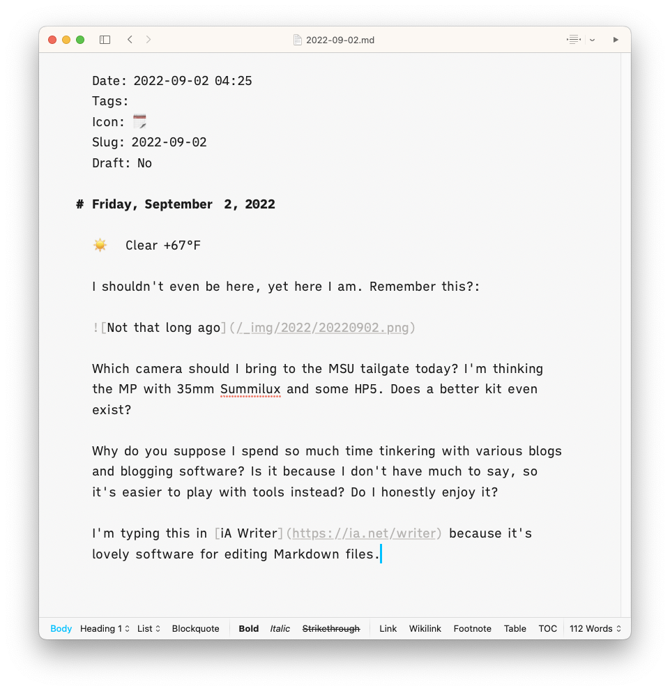

Date: 2022-09-02 04:25
Tags: 
Icon: 🗓️
Slug: 2022-09-02
Draft: No

# Friday, September  2, 2022

☀️   Clear +67°F

I shouldn't even be here, yet here I am. Remember this?: 

Which camera should I bring to the MSU tailgate today? I'm thinking the MP with 35mm Summilux and some HP5. Does a better kit even exist?

Why do you suppose I spend so much time tinkering with various blogs and blogging software? Is it because I don't have much to say, so it's easier to play with tools instead? Do I honestly enjoy it?

I'm typing this in [iA Writer](https://ia.net/writer) because it's lovely software for editing Markdown files.

And now I'm typing this in iA Writer on the iPad via synced Dropbox folder. Not terrible!

I tried migrating the sync settings for this blog from Dropbox to Google Drive. All I had to do was click a button and Blot moved everything for me. But then it never updated after that so I switched back to Dropbox. I'd stopped using Dropbox so I needed to install it on my iPad and was immediately interrupted with so many upsell ads that I almost threw the iPad across the room. It's a shame what Dropbox has become.