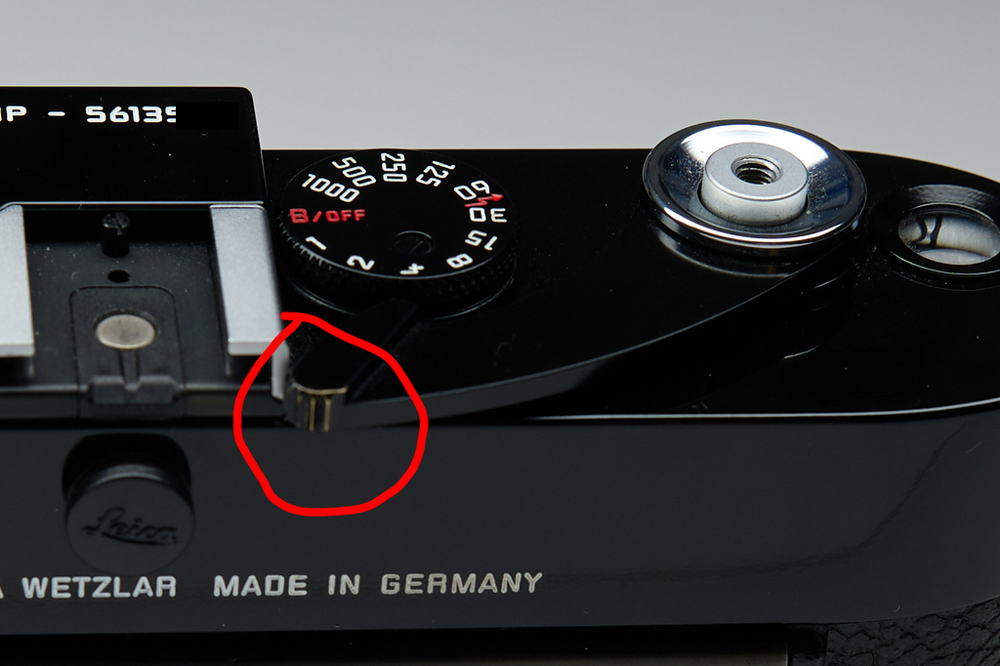

Date: 2022-09-14 04:36
Tags: 
Icon: 🗓️
Permalink: /2022/2022-09-14
Draft: No

# Wednesday, September 14, 2022

Above is another reason I couldn't sell the Leica MP. It's just beginning to "brass"...by my own hand. Now it's personal!

I'm experimenting with using [Olivetti mode](https://github.com/rnkn/olivetti) in Doom rather than Doom's default [Writeroom mode](https://github.com/joostkremers/writeroom-mode). Writeroom mode is a bit too aggressive. Olivetti just sets a readable line width by adding borders to the window. That's good enough. 

I've moved my book list to <https://baty.net/books>. It used to be in a Github repo using Github Pages to render a "website" but that's overkill for my simple markdown list of books. Of course Blot makes it easier because it does the Markdown rendering for me, automatically.
