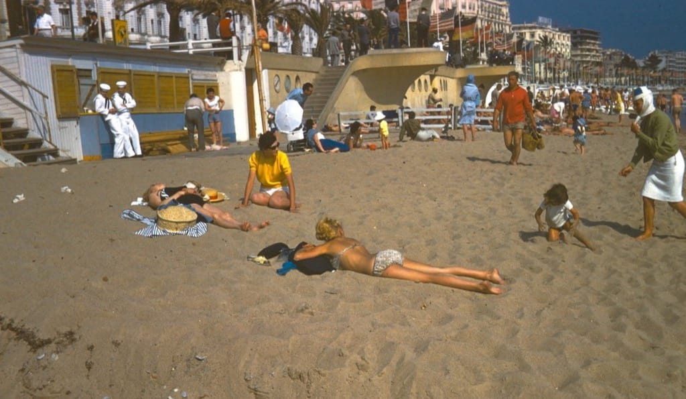

# Sunday, April 23, 2023

I love this photo, taken by my dad while traveling to France during his time in the Navy. There's just so much going on.

---

I write on paper a lot, and mostly in cursive. I don't understand, then, why my handwriting has become so much worse recently. Is it laziness? It can't be old age. Not yet anyway. It kind of puts me off writing that way.

---

Phil has been keeping copious [Darkroom notes](https://www.twelvety.net/2023/04/darkroom-notes-from-april-12) and I'm quite envious. I work fast and loose in the darkroom and so far I've been OK with that approach, but Phil's notes make me want to try being somewhat more fastidious about it.
