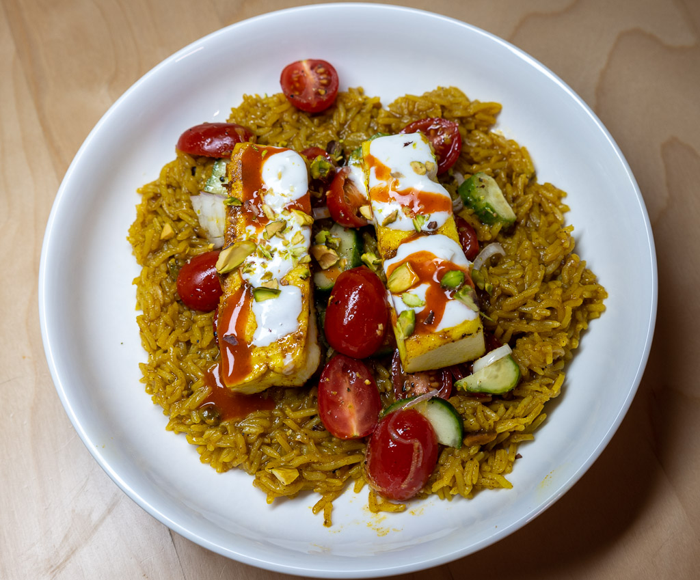

# Wednesday, April 26, 2023

I'm testing [Captee](http://yummymelon.com/captee/) on macOS. Captee adds an item to Share menus which convert links to either Markdown or Org-mode. It's the Org-mode part I'm most interested in, but I just used it for grabbing that Captee link in Markdown, too. (h/t [Mike Hall](https://mike.puddingtime.org/posts/2023-04-25-daily-notes/))

---

> Banalities intentionally made difficult by shooting them on film
> 
> <cite>Dante Stella, [Dear God, the film base is gray](https://themachineplanet.wordpress.com/2023/04/25/dear-god-the-film-base-is-gray/) 

> You don’t stop shooting film because a roll goes from being the cost of one
> Starbucks to two. You stop doing it when it ceases to have any real enjoyment.
> 
> <cite>[ibid]</cite>

Now I don't know if I want to shoot _all_ film or give it up entirely.

---

I fired up an Alt Twitter account this morning so I could shit-post a bit, and I feel dirty but that's really all Twitter is good for now.

---

You'll never convince me that using present tense in commit messages is correct. The idea that a commit message tells us "what will happen after the commit is applied" is all well and good, but it will only be read in that context for a short time, after which it will always be read as a log of what happened. Past tense. The fact that the imperative form is prevalent and I should "just follow convention" is your problem 😜.

---

My views around generative art are evolving. I've always considered it to be amazing as a technology demo, but completely uninteresting as capital-A "Art". But who am I to undermine someone's creative output, whatever its form or process? Just because a person can't successfully manipulate a brush coated in paint doesn't mean they're not full of creative energy and just looking for ways to express it. Good for them, I say.

---

If it weren't for Hello Fresh I'd never eat this kind of stuff. I'd never even _heard_ of grilling cheese before today.

