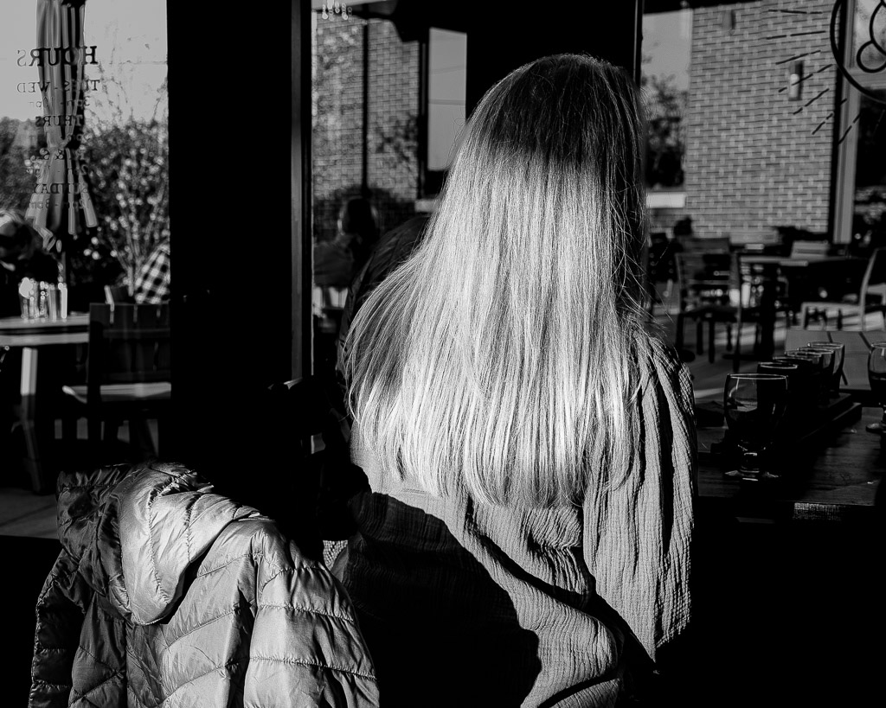

# Friday, April 28, 2023

Lots going on today that doesn't involve computers. This is a good thing but still kind of bugs me.

---

They're calling them "skeets" now so I quit.

---

Another quote from Freddie deBoer that struck me, considering my declining attitude toward social media everywhere (subscriber paywall):

>  To capture that opportunity, they should work a little harder to tamp down the annoying, aren’t-we-so-cute-and-clever behavior that’s common to their coalition and listen a little more to people who are not already part of that coalition. It’s boring and can be frustrating but it’s part of the deal with a maturing political movement. And the only way any of it gets any better is if people who have credibility within that culture are willing to say to others, “knock it off, and grow up.”
> 
> <cite>Freddie deBoer, [Do We Have a Responsibility to Deal with the Worst Elements of Our Own Coalitions?](https://freddiedeboer.substack.com/p/do-we-have-a-responsibility-to-deal?publication_id=295937&post_id=115409774&isFreemail=false)</cite>

---

