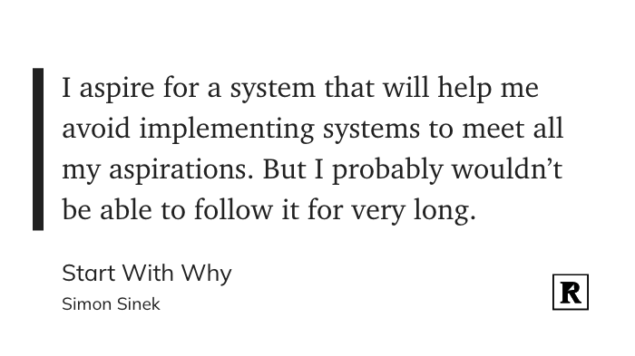

# Sunday, April 30, 2023

Bluesky has a real "You can't come here if you're not one of us" vibe right now. I mean, someone suggested that anyone even _inviting_ someone "bad" should be banned. What do you think is going to happen when it's out of beta and anyone can join? People are people. I can't wait to stop talking about Bluesky. I shouldn't even have posted this, but it's bugging my how both Mastodon and Bluesky think they can enforce culture at scale.

---

---

I'm eeking my way back into [Mastodon](https://social.lol/@jbaty). I've unfollowed a few and disabled boosts from nearly everyone. Let's see how it feels.