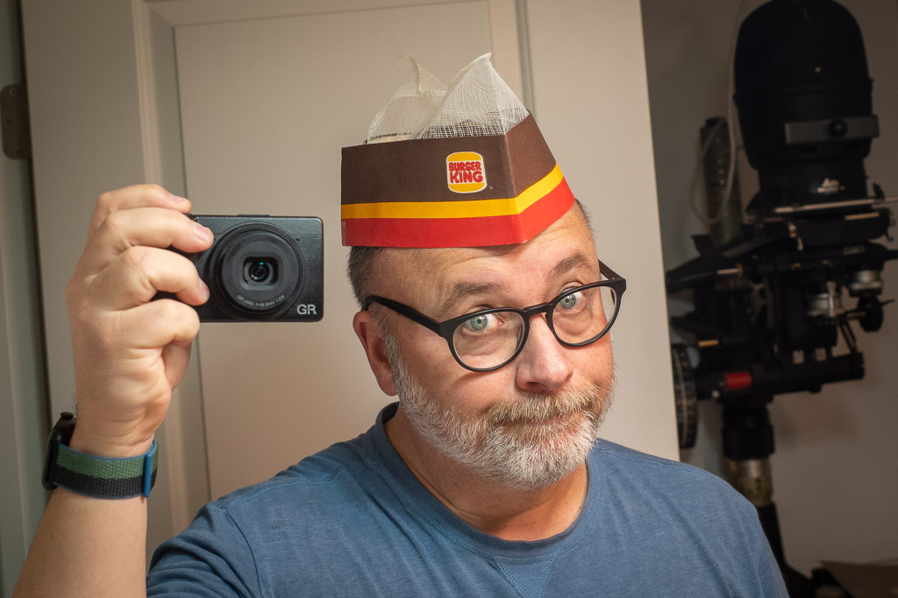

# Saturday, May 6, 2023

And speaking of kings, I somehow still have my crown (from 1982).

---

Whenever I go to Founders, a take a snapshot of this garage for some reason:

---

Blog post about making Mu4e better for me: [A couple of Mu4e improvements](https://baty.net/2023/mu4e-improvements)

---

I had to call the IRS about an issue with my tax returns. It was surprisingly not unpleasant.

---

I didn't think I needed something like [TextSniper](https://textsniper.app/) on my Mac, but turns out I use it many times every day. Recommended.

---

I'm spending time today consolidating several Lightroom (Classic) libraries. In recent years, I've created a new library for the new year and then I'd merge them the following year. The idea was that it's nice to start "fresh" and not have to lug around 100k images all the time. Turns out that managing separate libraries is work, too, so I'm ditching that plan. One big catalog in LrC is fast enough, and less work.

---

> Defederating an instance is an extreme measure and it should only be taken in extreme circumstances.
> 
> Finding out I might stop getting posts from people I explicitly follow because they happen to be on an instance being defederated by mine all because a bunch of admins I don't know got in a spat over a user I don't follow is just about the most annoying value proposition imaginable.
> 
> <cite>Rod Hilton, [Mastodon](https://mastodon.social/@rodhilton/110317964109228557)</cite>

I like the _idea_ of federation, but in practice (by Mastodon) does not instill confidence in the network. If Bluesky can implement federation as well as they have onboarding, I worry about Mastodon. 

Also, right now Bluesky is a brimming with trans people having a blast. Meanwhile, Mastodon is loaded with people defensively sour-graping about "proper" federation or scolding each other about CWs. I don't need to tell you which one is more fun.

