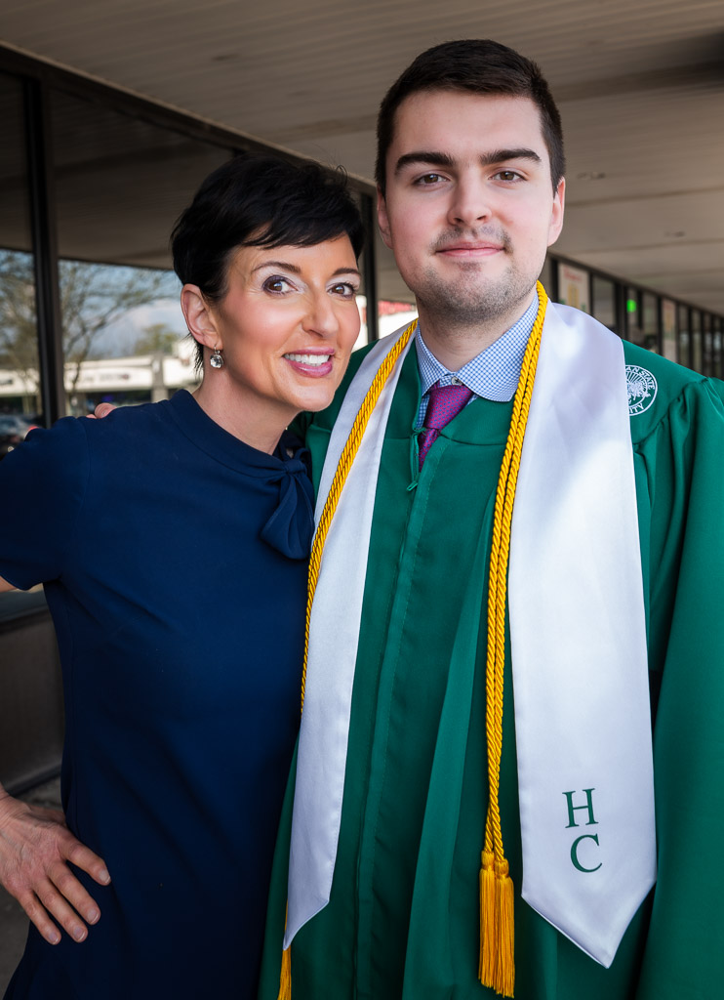

# Monday, May 8, 2023

I spent like 2 hours fiddling with the AI "Prompt Workbench" and associated AI tools in Tana. It's neat, but doesn't feel worth the trouble, somehow.

---

> Read three books on a topic and you know more about it than 99% of the world. Watch news all day for years and you have a distant, water-cooler-level awareness of thousands of stories, at least for the few weeks each is popular.
> 
> <cite>David Cain, [Five Things You Notice When You Quit the News](https://www.raptitude.com/2016/12/five-things-you-notice-when-you-quit-the-news/)</cite>

I haven't followed the news in years. It's better this way.

---

My stepson Aidan graduated (with high honors!) from MSU yesterday. Here's a photo of he and his mom, taken outside of the restaurant in which we were celebrating. We're all very proud of him.

