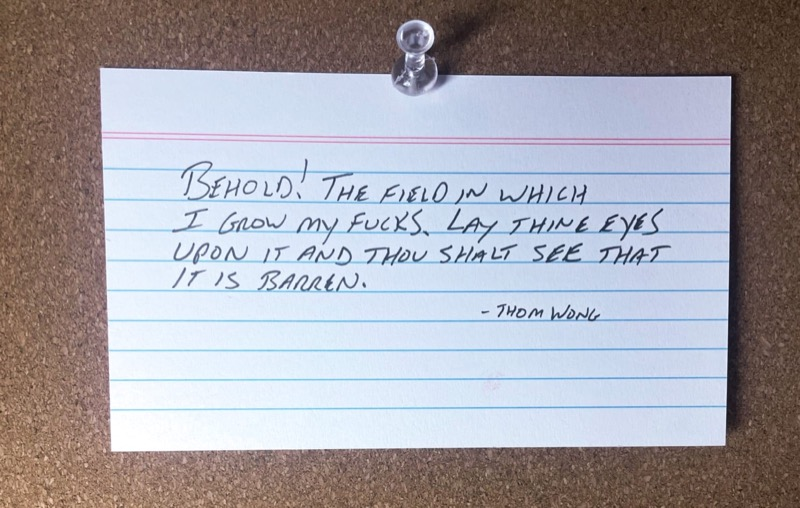

# Sunday, May 28, 2023

I expanded the paragraph I'd written earlier about social media in a separate post: [Withdrawing from social media](/2023/withdrawing-from-social-media) 

---

Instead of posting directly to social media, what about posting a short summary and a link on Micro.blog each day? That might feel too much like advertising, but should reduce the need to monitor replies quite so frequently, but still allow me to more likely share things. Something to think about.

---

Creative tools based on generative AI are amazing and feel like technological miracles. They allow people who may not have an intrinsic ability to create things using existing tools to express their creativity in all sorts of new ways. This opens up so many doors. On the other hand, I find that when scrolling through feeds, I skip over images that look (too) amazing because they're "probably just from Midjourney". And now, after playing with the Generative Fill features in the new Photoshop, I am impressed but also melancholy. Nothing is real anymore. The urge to tamper with an image and the ease with which it can be done is going to mean that fewer and fewer images will remain authentic. It doesn't matter how cool a photo is, if it's faked, it's fake and therefore meaningless to me. 

---

Some say that only providing an email link for comments on a blog will prevent readers from benefiting from any conversations that might be had on a topic. I agree with this, but it doesn't offset the negative effects caused by the performative nature of public comments. So, send me an email. If I feel like others are missing something valuable from our conversation, I'll update the post with a summary. How's that?

---

