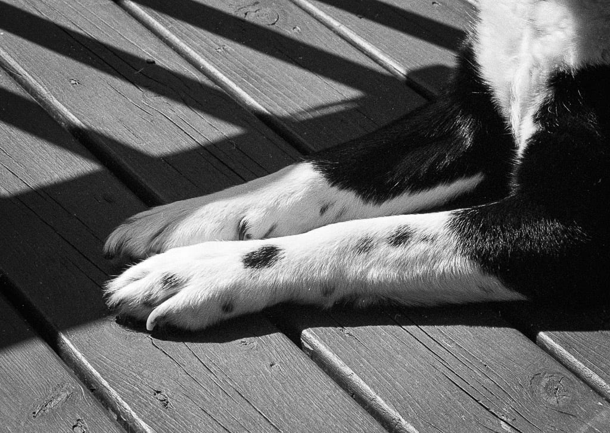

# Tuesday, June 6th, 2023

Day 2 of my week long experiment using Obsidian for writing notes and blog posts. I still don't like it. And yet I'm spending plenty of time farting around with themes and such, so at least it feels familiar 😁.

---
I just noticed that my posts' images aren't showing in the RSS feeds because I'm using Hugo's page bundles which I guess generate relative links. My old theme handled this properly, but PaperMod doesn't. Also, cover images aren't included in the feed. I swear I'm going to end up back in WordPress if this keeps up.

2 hours later: I pulled the plug and moved the blog back to WordPress. I hate myself now, but less than I did this morning.

