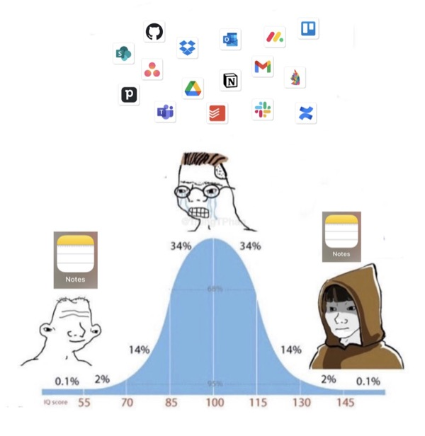

# Thursday, April 27, 2023

I love this (by [@TrungTPhan on Twitter](https://twitter.com/TrungTPhan/status/1650944073229008896)):

---

Bluesky really does feel like early Twitter. I'm not sure how long it will last. It's different than Mastodon. There's room for both, maybe. (Or perhaps [neither](https://baty.net/2023/im-weary-of-social-media)).

---

The world is full of people who take themselves far too seriously. I'm reminded of this with every visit to LinkedIn.

---

After a day of frustration with all of the social networks, I'm taking a break. I'm exhausted and disgusted by all of it. Stepping back is healthy.

---

> Automakers are starting to admit that drivers hate touchscreens. Buttons are back!
> 
> <cite>David Zipper, [Slate](https://slate.com/business/2023/04/cars-buttons-touchscreens-vw-porsche-nissan-hyundai.html)</cite>

And none too soon. Touch screens are stupid and dangerious in cars.

