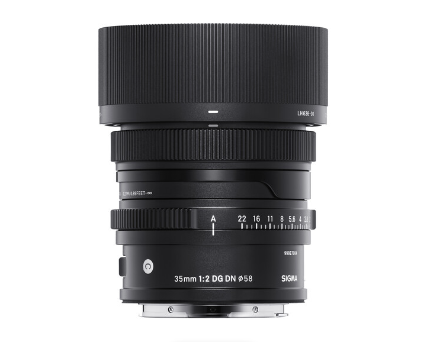

Date: 2022-09-18 06:47
Tags: Photography
Icon: 🌀
Permalink: /2022/a-short-review-of-the-sigma-35mm
Draft: No

# A (very) short review of the Sigma 35mm L-mount lens

I bought a Panasonic Lumix S5 primarily for scanning film negatives, but since it also happens to be a fine digital camera, I bought a some lenses to go with it. One of those is the [Sigma 35mm f/2 DG DN Contemporary](https://www.bhphotovideo.com/c/product/1605135-REG/sigma_35mm_f_2_dg_dn.html). I kind of love it.

It's a very good lens. It's no [Leica APO Summicron 35mm](https://baty.net/2020/leicas-apo-summicron-sl-35mm-asph), but it's in the ballpark. I find that it does a great job. It renders sharp, clean, and with decent bokeh. It seems well-built. I have no problems with how it looks or feels.

It has an aperture ring. All lenses should have aperture rings.

It cost nearly 10 times less than the APO Summicron.

That's it! One day, I'll probably have the Summicron again, but for now this little Sigma makes me happy because it's so good and was very inexpensive compared to the Leica.

Here are a few snaps I've taken with the lens.

