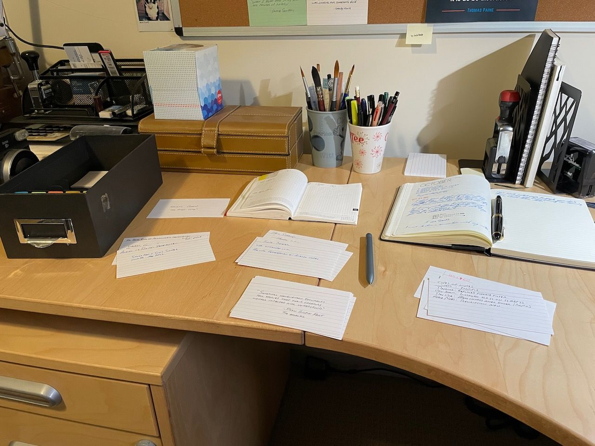

# Personal Knowledge Management is exhausting 

I’ve been testing the hot new [Tana](https://tana.inc/) app for the past week, and I’m exhausted.

First, I don’t need a [Zettelkasten](https://en.wikipedia.org/wiki/Zettelkasten). If you’re being honest, you probably don’t either. And yet, we spend hours or days learning the “proper” way to build one. Then we set up our new system, using paper or digital or both, roll up our sleeves, and waste time putting stuff into it.

The worst part isn’t the putting of stuff into my PKM (Personal Knowledge Management) system. The worst part is all of the tinkering around _where_ to put stuff and how to classify/tag/organize it.

I made the mistake of reading “[How to Take Smart Notes](https://www.amazon.com/How-Take-Smart-Notes-Nonfiction/dp/1542866502)” by Sönke Ahrens and browsing the [forums](https://forum.zettelkasten.de/) and that sent me on a spiral of worrying about atomicity, what to do about “fleeting” notes, how big is a Zettel? and so on. In other words, I was more concerned with finding the proper method of managing my notes rather than focusing on what was actually in them and what they were _for_.

This week’s tinkering with Tana hasn’t helped. Tana is the next iteration of tools based on things like [Roam Research](https://roamresearch.com/), [Notion](https://notion.so/), etc. I like it. It’s a bit like [TiddlyWiki](https://tiddlywiki.com/) and [Tinderbox](https://www.eastgate.com/Tinderbox/) in that it allows for additional attributes to be associated with each node and makes these ontologies easy to search, link, parse, summarize, etc. It makes some complicated workflows pretty easy to implement. I think a lot of people will dig it.

The problem is that this flexibility leads to a lot of hand-wringing over the best way to utilize all this power. The Tana Slack channels are teeming with questions about workflows and structure and attributes and on and on. It makes me tired just reading about it.

I’m not sure I need a system around, for example, the best way to surface the minutiae from interstitial journaling. In fact, just using the phrase “interstitial journaling” is a dead giveaway that I’ve already been overthinking it. Settle down, Jack!

Anyway, I’ll keep playing with Tana for fun, but I’m probably not going to continue using it for my notes. It’s not something I will benefit from, especially considering the amount of effort I’ll put into setting it up and getting everything “right”. I’m exhausted and I think I’ll go back to using paper. Or maybe Emacs.