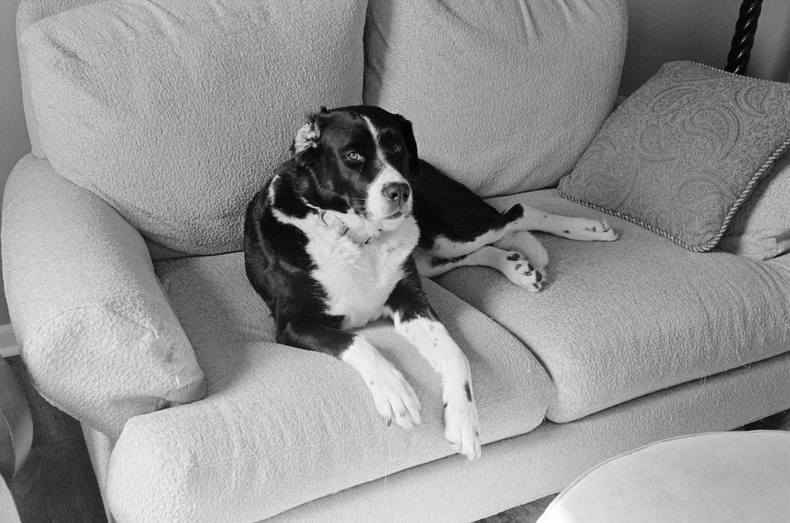
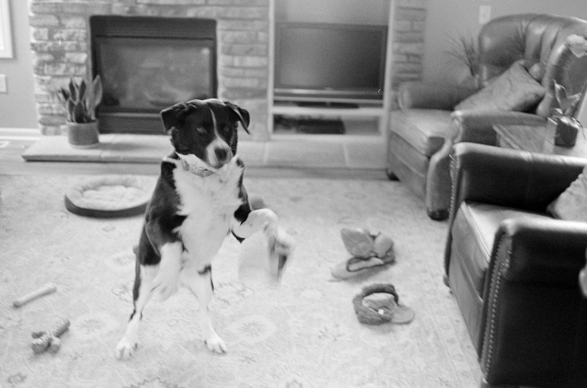

# Sunsetting the Canonet

This is probably the last roll I’ll run through the Canonet. I can’t seem to focus it and I don’t trust the shutter speeds. Also, it has scratched a couple of negatives and the frame spacing is all over the place. It’s a nice camera to look at, so that’s how it’ll spend its remaining days.

Here are a few more from that last roll. I told you I can’t focus it.

{{more}}

