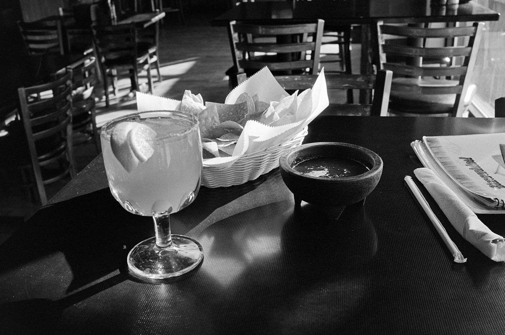

# It’s never the photos one expects to like

I took the above photo while waiting for a friend to arrive at the restaurant and I love it.

It’s a film photo. It’s slightly misfocused. It’s boring. But still, I keep looking at it. I made an 8×10 darkroom print that I’ll probably mount and hang.

What is it about photos like this that I like so much? Honestly, I don’t know, but I expect that it’s all about what it represents to me. The photo in the restaurant, for example, reminds me of friends. And of my favorite restaurant. And my favorite “Ultimate” margarita. It may not be art, but it’s meaningful to me, and that’s become the most important part.