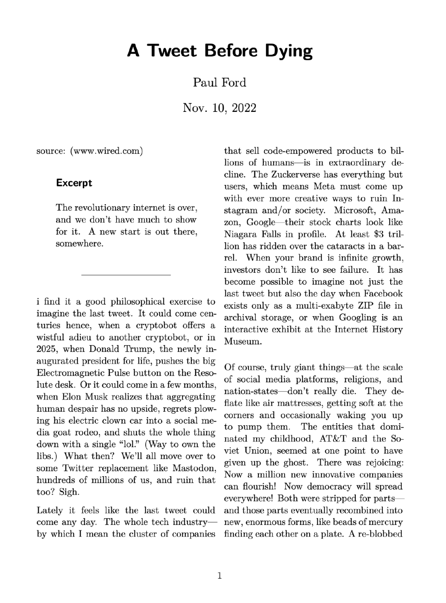

# Printing web pages


In 2020 I wrote,

> I no longer try to read longer-form articles right away. I instead send them to Instapaper and, after a day or two, review the inbox, delete the ones I no longer care about, and print the ones I do.
> 
> [Reading Long-Form Web Articles By Printing Them First](https://jackbaty.blot.im/2020/reading-long-form-web-articles-by-printing-them-first)

I still print web pages for later reading, but I’ve updated the way it works.

I’ve replaced Instapaper with [Zotero as my read later service](http://localhost:1313/2021/using-zotero-as-a-bookmarking-and-read-later-service/). Zotero is overkill for this, but it’s free, local, and makes the articles I save usable as references if needed.

When I’ve found an article that I want to print and read, I visit the page and use the excellent [Markdownload web clipper extension](https://github.com/deathau/markdownload). Markdownload grabs the meat of the article, converts the HTML to Markdown, and (optionally) adds front matter and metadata to the document. Here’s an example:

```markdown
---
created: 2022-11-12T08:40:29
source: https://www.wired.com/story/tweet-dying-revolutionary-internet/
author: Paul Ford
documentclass: scrartcl
classoption:
- twocolumn
---

# A Tweet Before Dying | WIRED
source: ([www.wired.com](https://www.wired.com/story/tweet-dying-revolutionary-internet/))

> ## Excerpt
> The revolutionary internet is over, and we don’t have much to show for it. A new start is out there, somewhere.

---
i find it a good philosophical exercise to imagine the last tweet. It could come centuries hence, when a cryptobot offers a wistful adieu to another cryptobot, or in 2025, when Donald Trump, the newly ...
```

I add the `documentclass` and `classoption` front matter manually. These options are used by [my pandoc template](https://gist.github.com/jackbaty/af608b15aae82349c77b97333829b521)[^1] when converting the Markdown file to PDF using [Pandoc](https://pandoc.org/). The rest is handled automatically by the extension.

Once I have the Markdown file, I convert it to PDF either via a [BBEdit](http://www.barebones.com/products/bbedit/) script or [pandoc-mode](http://joostkremers.github.io/pandoc-mode/) in Emacs.

Here’s what the PDF looks like:



After that, it’s off to the printer.

Admittedly, the setup for this took me some time, but now that the hard part is done I can go from web page to a typographically beautiful printed document in about a minute. It’s been totally worth it.

[^1]: My template is just a slightly modified version of the one that comes by default with Pandoc.