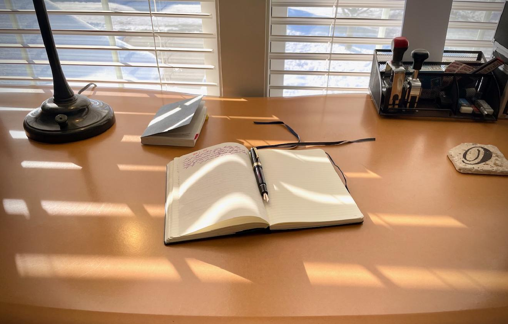

# Calm Technology

I’m overwhelmed by social media right now. Visiting Twitter just makes me anxious because it’s become an even bigger shit-show and all anyone can talk about is how much of a shit-show it is.

And Mastodon is almost worse, since the only topics there right now seem to be the Twitter shit-show (but everyone calls it “birdsite” for whatever stupid reason) or how Mastodon is or isn’t confusing or is or isn’t racist or else over-explaining what the “fediverse” means to the future of the internet.

Everyone is just so breathy and I’m exhausted by all of it.

So, instead, I’ve been writing journal entries on my blog, updating my wiki, and sitting at my writing desk with a pen and a notebook. It’s the latter of these things that brings me a nice sort of calm. It’s not really even technology but it’s where I increasingly wish to spend my time.