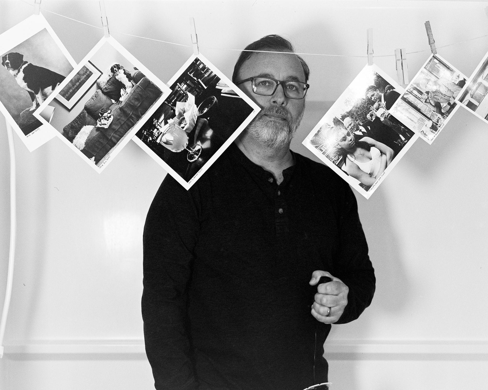
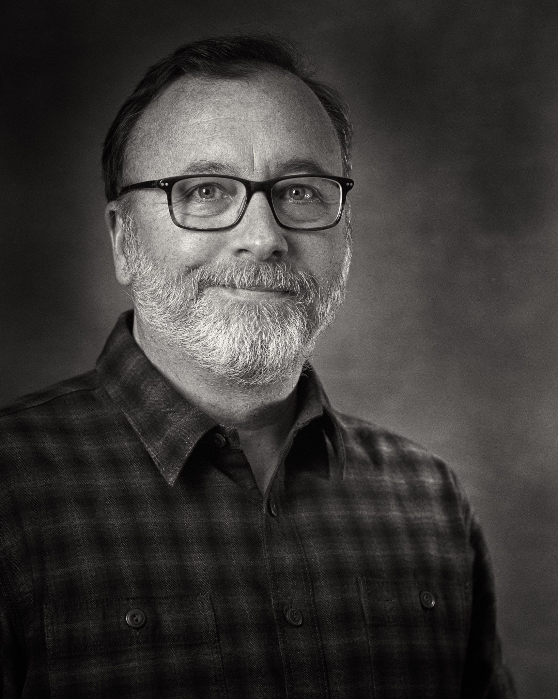

# How I’m feeling about large format film photography

The short version is that I have a love/hate relationship with large format film photography.

I love the detail and depth. I love the tonal values and focus fall-off that seem impossible with smaller formats. I love that I can decide on a frame-by-frame basis what film, developer, or process I’m going to use. There’s no waiting until the end of a roll. It’s as close to instant gratification as one can get when shooting film. I love the big negatives!

On the other hand, everything else about large format is a pain in the ass. I thought I’d do studio and environmental portraits when I bought my first 4×5 camera in 2013. I admire the portrait work of photographers like Judy Dater and Judith Joy Ross who worked primarily with large formats. It turns out I’ve only done a handful, and most of them are self-portraits. An example…

When they work, they really work. There’s nothing like it. But when they don’t, it just ends up being a giant waste of time and money. My “hit” rate is pretty low, so the net result is that I get very few images that I love and a lot more that are mediocre or worse.

And then there’s all the supporting gear needed. Loupes and dark cloths and tripods and hoods and releases and bags and film holders. Not to mention that printing 4×5 film requires a ginormous enlarger.

Film is expensive, large format film is more expensive. Per exposure prices are hovering around $2.25 for black and white and $5.50 for color. Then there’s all the gear for processing 4×5 sheets.

The more I think about it, the more I wonder if it’s all worth it. I guess if I could have a permanent studio with a camera mounted and ready to go, it would be easier to justify all the fuss. But setup and teardown introduces so many opportunities for failure that I’m less and less likely to bother.

Maybe one day I’ll decide it’s worth the trouble, but right now I’m thinking of leaving large format film photography behind.

When I feel the urge for smooth, high-detail film photography, I think that medium format (120) and the Hasselblad will do just fine, and without nearly as much fuss.

