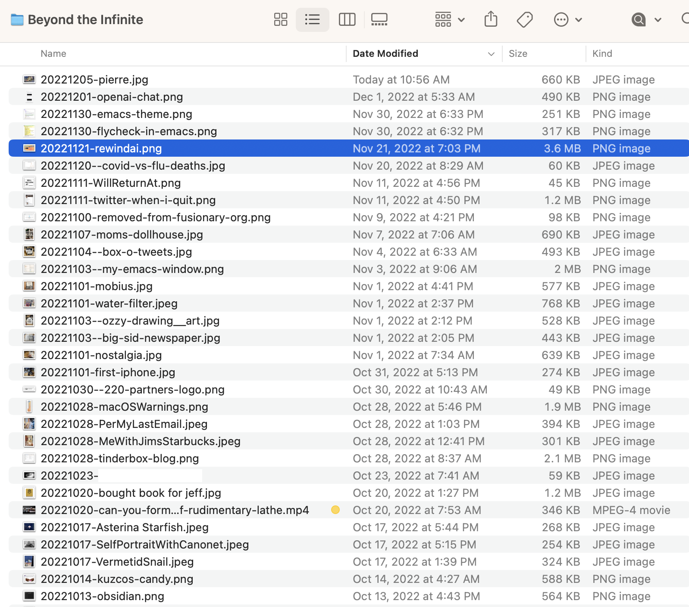

# Beyond the Infinite

I collect a lot of “stuff” on my computer. I’m one of those lazy people who just drop most of it onto my Desktop and assume I’ll figure out what to do with it later. The problem is, I rarely actually figure out what to do with most of it.

Late last year I created a folder on my Mac’s desktop named “Beyond the Infinite”[^1] . Anything that ends up on my desktop that isn’t important enough to file away but is something that I’d still like to keep, “just in case,” gets tossed into Beyond the Infinite.

It’s become a minor treasure. It’s like a journal of things that barely matter at the time, but become valuable later. Screenshots, text snippets, URLs, etc. I love it.

[^1]: You're right, it's a [2001: A Space Odyssey](https://en.wikipedia.org/wiki/2001:_A_Space_Odyssey_(film)) reference.
