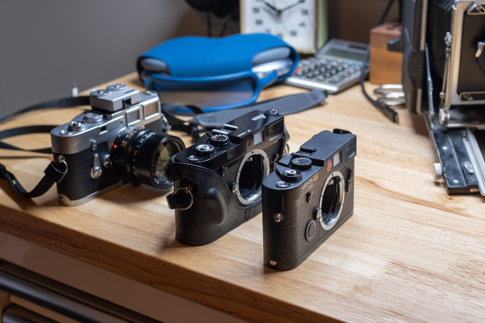
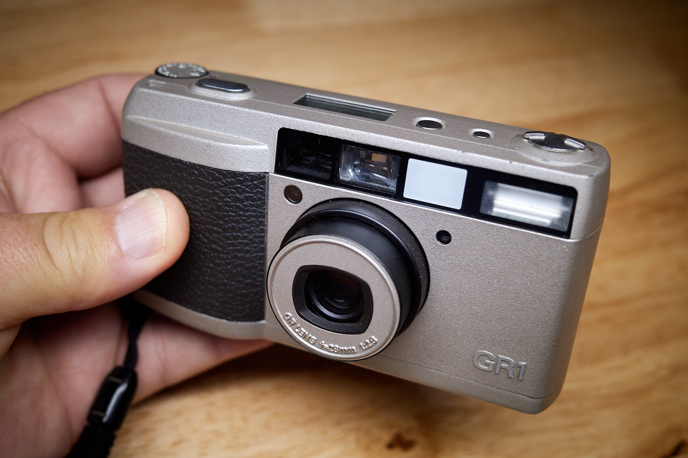
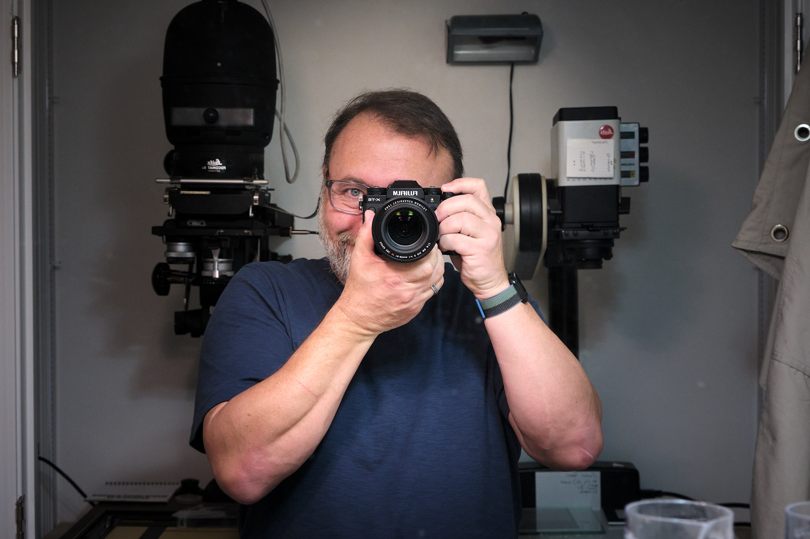

# My camera situation at the end of 2022

2022 has been another year of wildly rearranging my approach to photography. I’ve gone all-in Leica and back. I’ve been all-in with film, and back. And so on. I do this because I’m more of a camera nerd than an artist.

Let’s start with the film cameras. First, I sold the big Linhof Master Technika. It was a beautiful kit, but I almost never used it. I still have an old Crown Graphic for when I get the urge to shoot 4×5.

I still have three Leica M film cameras: M3, M6, and MP. I tried and failed at selling the M6. Here they are on my workbench:

The M6 is for sale again. I will hate myself for selling it, but it’s dumb to have something so nice (and valuable) just sitting on a shelf most of the time.

I was also able to revive the Ricoh GR1, which I’m very happy about.

So, what about digital, then? That’s still being tweaked, but right now I’m going with the new X-T5 and a few favorite lenses.

I ordered the X-T5 with the 16-80 “kit” lens. I don’t like zooms, and I don’t love f4 lenses, but it’s a nice all-arounder in a pinch and a cheap way to get it. I have the 23 f2, 35 f1.4, and 56 1.2 on the way.

I’ve stopped scanning film with a digital camera, so I shouldn’t miss the Lumix S5 and Macro, which I’ve traded for the Fuji lenses. I can change my mind pretty inexpensively with the Fuji 60mm macro any time.

I have come _very_ close to buying another Leica M10-R, but I’m going to see how it feels to use the Fuji for digital.

Where does that leave us? To sum up:

**Every Day(ish) Carry:**

*   Leica MP
*   Ricoh GR1
*   Fujifilm X-T5

**Change-of-Pace Carry:**

*   Leica M3
*   Hasselblad 500C/M
*   Crown Graphic 4×5
*   Assorted 35mm (OM-1n, Leica IIIf, etc)

