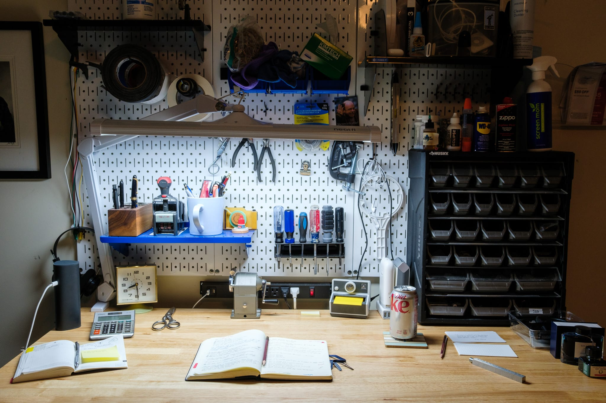

# It was meant to be a workbench but has become a writing desk

I put together a workbench in the basement after moving into my wife’s house. It has all the things I might need for minor repairs or electronics projects. You know, in case I ever feel the urge to fix or build something.

I often imagine myself as someone handy with tools. Someone who is not just creative, but can actually implement his ideas. Or someone who can repair things. It’s fun to imagine myself as that person, but I am not that person.

Since the “maker” urge hasn’t arrived, instead of using my workbench as a workbench, I’ve been using it as a standup writing desk. I have my notebooks and paper-related doodads within reach on a shelf to my left. My pens and stamps and pencil sharpener are on another shelf in front of me. It’s working out well, so I don’t mind that it isn’t used for what I intended.
