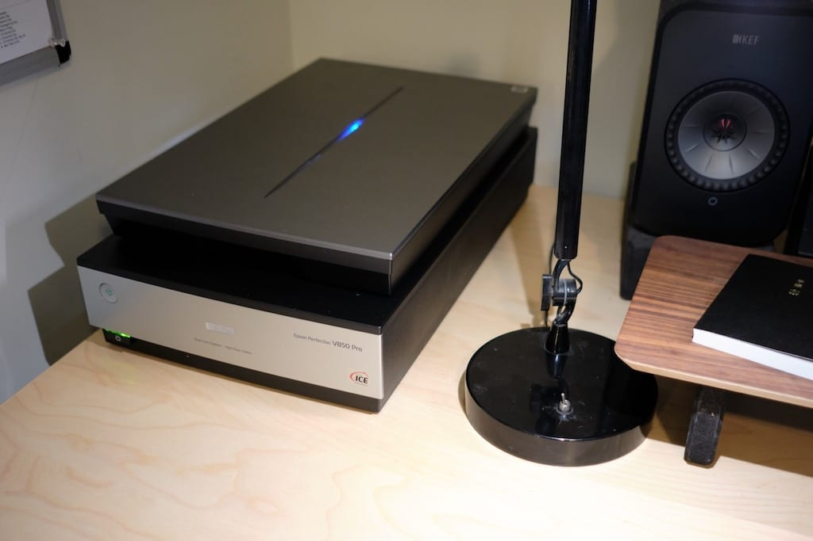
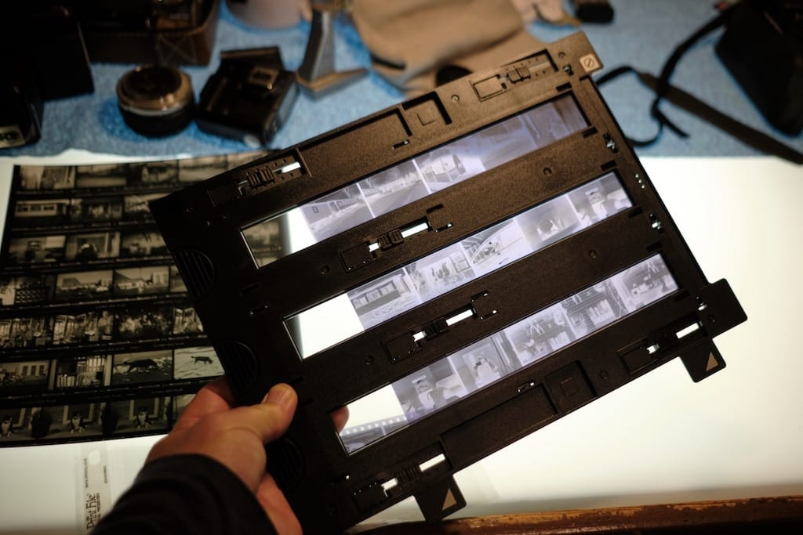

# Back to scanning film with a real scanner

I tried, I really did. The Wise Old Internet guided me into changing my film scanning process from a dedicated flatbed scanner to using a [mirrorless digital camera setup](https://baty.net/2020/using-the-skier-sunray-copy-box-3-for-digital-film-scanning). I did everything right. I bought good equipment and the right software.

I hated it.

To scan using my flatbed, I load the negatives, hit “Prescan”, confirm that things look ok and press “Scan”. I go do something else for a while and come back to a folder full of JPGs. I edit the files by adjusting contrast and cropping as needed in Lightroom or whatever and I’m done.

What the internet told me was that I needed a mirrorless digital camera, a quality Macro lens capable of 1:1 magnification, a copy stand, a bright, even light source, film holders/transports for every size negative I plan to scan, and Negative Lab Pro (which requires the use of Lightroom Classic).

To scan negatives using a digital camera, I first have to mount the camera, level it correctly, set up the appropriate negative mount. Then I make sure it’s focused properly, and adjust camera settings as needed. Then for each frame, I advance the film, trip the shutter, advance, and repeat 36 times. Then I must import the raw scans into Lightroom, load the NLP plugin, convert all of them, then adjust them using NLP. Finally, I have to export positive TIFF or JPG copies from NLP. I just don’t see how this is easier. No one agrees with me, but the old way is better.

What about scan quality? That depends upon a hundred variables. Honestly, I can probably squeeze a tiny bit of quality/resolution from the digital camera scans, but the effort getting there isn’t worth it. My flatbed 35mm scans are fine, although if you read anything online you won’t believe me. “Flatbed scans are shit!” is the usual trope. OK, but they look good to me, thanks.

Also, the grain from dedicated scanners looks better. And if I’m shooting color, there’s no match for digital ICE.

I tried the new way, but I prefer my old-fashioned scanning system.

