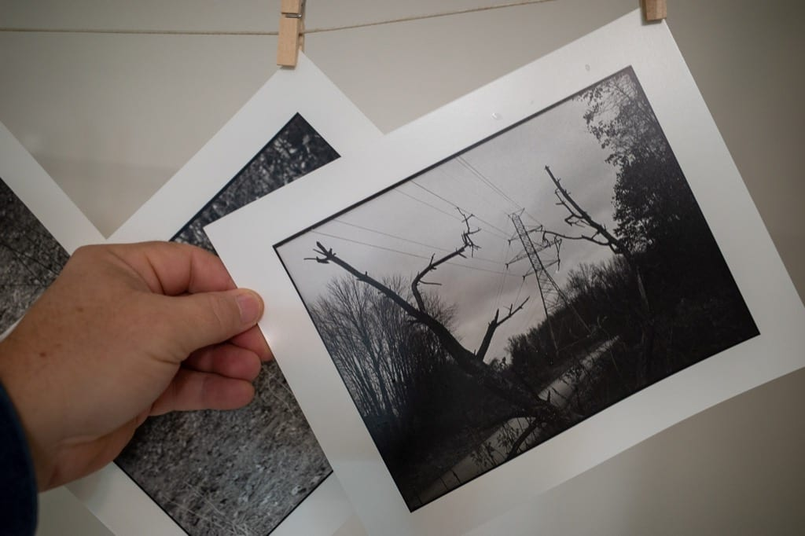
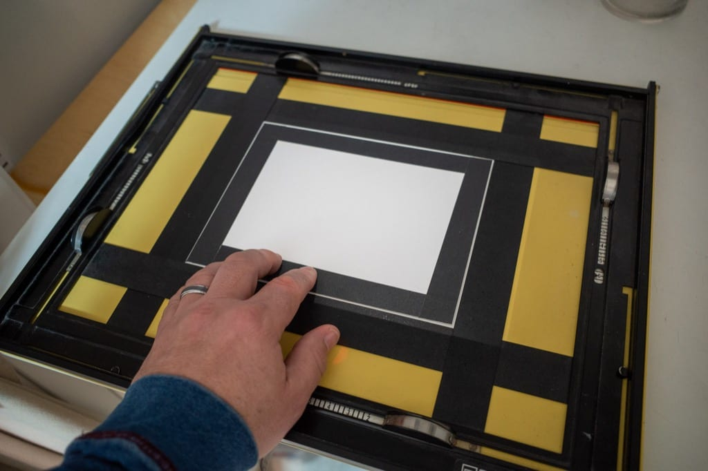
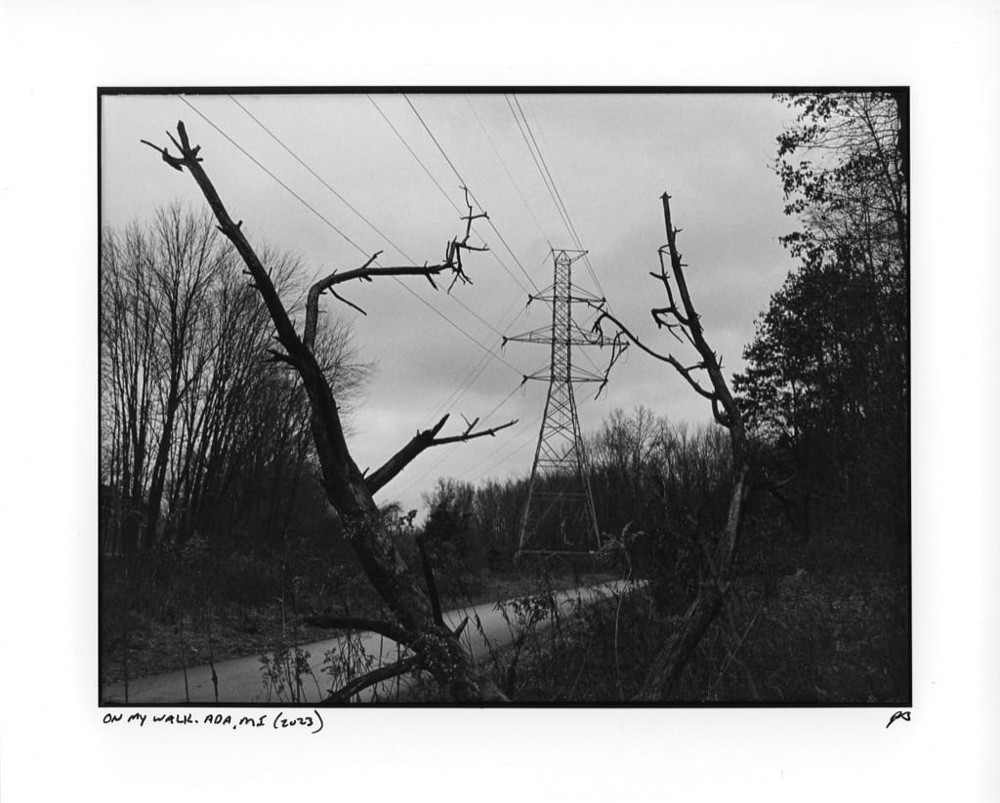

# Darkroom printing with borders

I like the way prints look with a small black border around the image, like this:

I know some people file their negative holders but that means no cropping and there’s no way I’m precise enough with framing to not crop about 90% of my images at least a little.

What I did instead is cut a piece of poster board ever so slightly smaller than my usual print size. I place this over the image after making the initial exposure and do one more quick 5-second exposure for the border.

This works, but it’s difficult getting the board lined up evenly. For now, I’m writing that off as providing uniqueness but I’m still looking for something better.

I almost always print 6″x8″ on 8″x10″ paper, so this will be fine most of the time. If anyone has a better technique, I’d love to hear about it.

UPDATE: I received the following tip from Nick Fanzo: "It’s more accurate to cut the board so you hold it to one corner, expose, and then move the card diagonally to the other corner and expose again. You’ll get more even borders."

That's much better!
