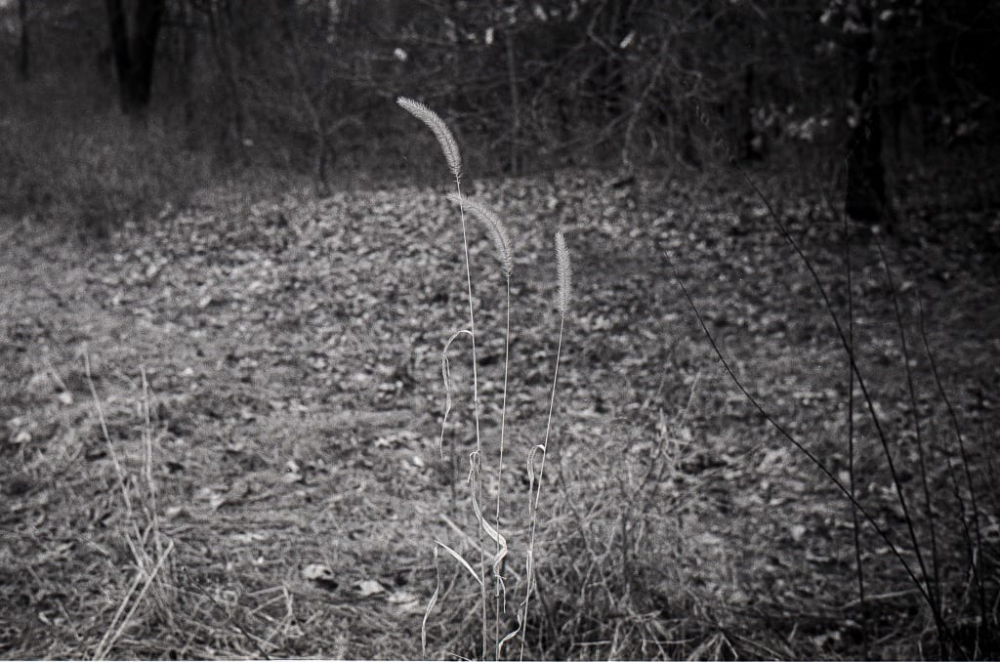

# Roll-099 (Leica MP)

I took the MP on my walk and was determined to shoot an entire roll. It was overcast, dreary, and the path I walk is pretty boring, but I did my best and made it through the roll.

This roll was shot at 800 and developed in HC-110 (Dilution B) for 7.5 minutes.
