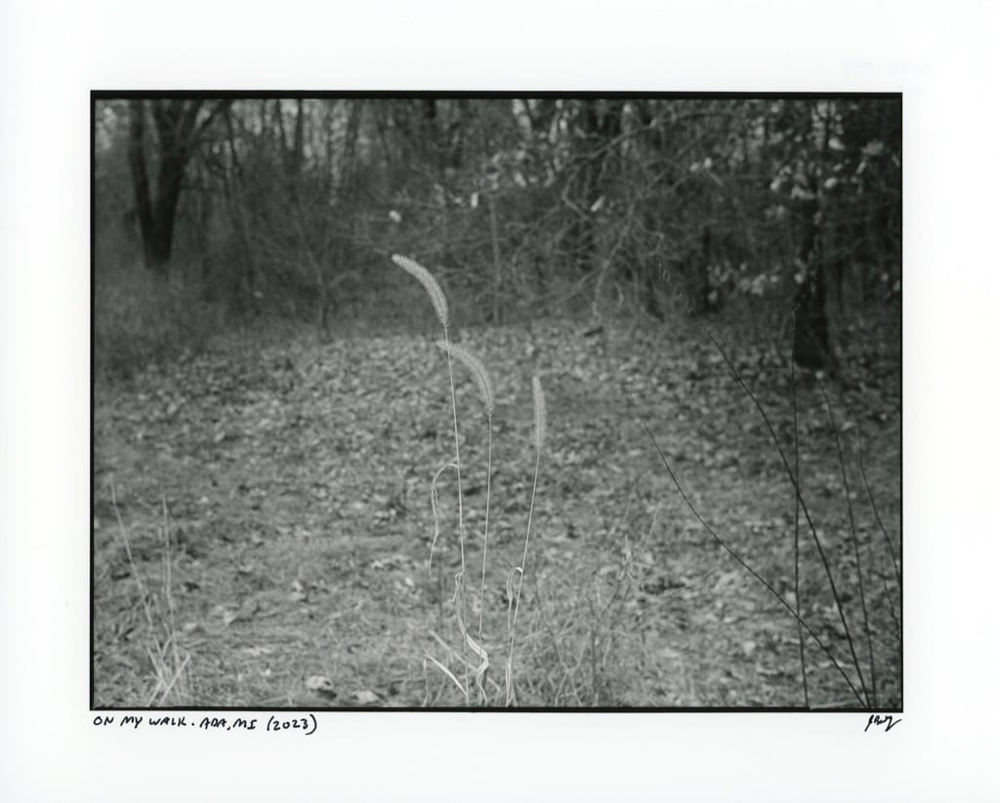

# I don’t know what I want

This has been a tumultuous week for me, photography-wise. Early in the week, I made this silver gelatin darkroom print of a 35mm frame of HP5 film.

It’s a photo of some weeds I took while out walking. That’s it. But I made it using my favorite camera and it’s a “real” chemical photograph on actual paper. I like it very much.

Then yesterday, I took the following self-portrait using my new Fujifilm X-T5 digital camera in my home studio.

Here’s my dilemma: I like them both, but never equally or at the same time. One moment I love everything about shooting film with my Leica and printing using only light and chemistry in the darkroom. It feels like making art, even when the objective technical quality is lacking. In fact, the lack of technical quality is what I look for when shooting and printing film.

Then, a moment later, I can’t understand why I’d bother with all that when I could simply shoot digitally and easily produce a clean, sharp, colorful self-portrait using strobes and backgrounds without all the finger-crossed guessing and expensive failures.

What all this means is that I don’t think I’ll ever be able to commit to a single form of photography. There are too many fun and exciting options to limit myself to just one. It also means I’m unlikely to ever develop the “Baty Aesthetic™” that I always think I should have. It means I’ve no “vision”. Oh well, it’ll have to be OK that I’m all over the place, creatively.

