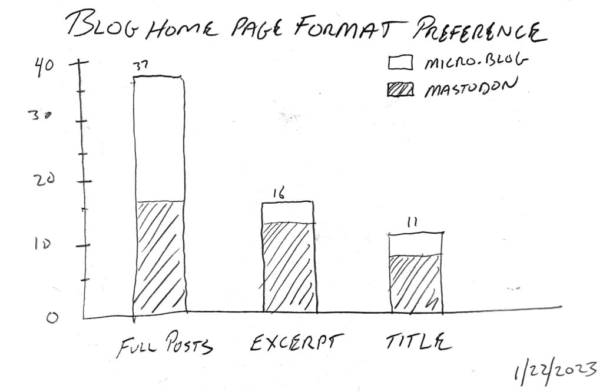

# Survey results: Blog post format preferences

I can never decide which blog post format I should use on my home page(s). Should I use full posts so that all of the content is available by simply scrolling? Should I shorten each post to just a title and a short summary, making it look more consistent and easier to scan? Or maybe I should only include a list of titles, and let people dig in based on that.

To find out what readers actually preferred, I asked the following question on Mastodon and Micro.blog:

**When visiting a blog (not via RSS), which layout do you prefer?**

*   **Full posts**
*   **Titles and brief excerpt**
*   **Titles only**

I received 64 replies. Here are the results:

I wasn’t surprised by these results, other than the Micro.blog responses leaned quite heavily toward full posts, while Mastodon was split closely between full posts and excerpts.

This helps me with how I present posts on my blog. I will continue using full posts, but I’ll truncate longer articles with a “read more” link to reduce the amount of scrolling needed.

Thanks to everyone who responded!
