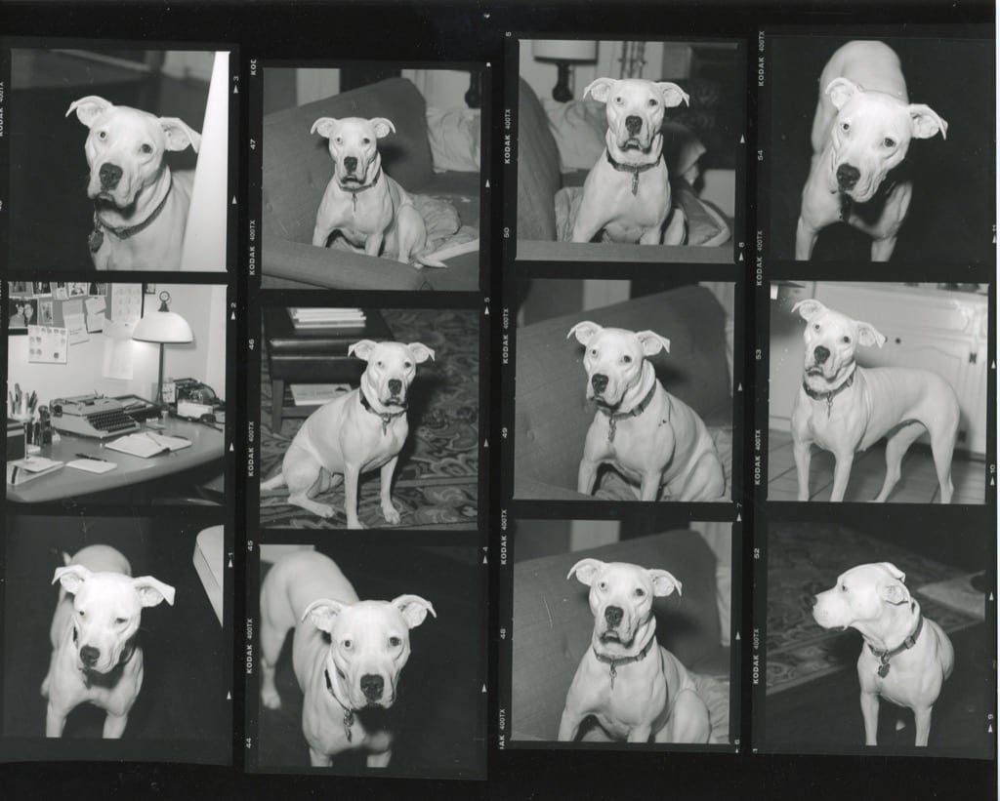

# Contact Sheet: Josie

I adopted Josie years ago. She was a sweetie but was incapable of being around other dogs, and my life at the time involved being around other dogs. We found a new home for her with a lovely woman who enjoyed dogs but had none. What she did have was 5 acres of land and immediate love for Josie.

I recently ran across the above contact sheet taken shortly after bringing her home. I love medium format contact sheets, since they make a fun polyptych. I often make a second contact sheet expressly for hanging. Sometimes I make a third and cut the small images out for my journal.

I could cheat with digital photos and make something similar, but it’s not the same.
