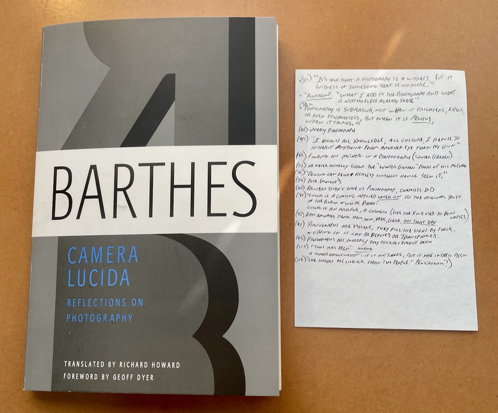

Date: 2023-02-02 06:28
Tags: Analog, PKM
Icon: ️🌀
Link: /2023/my-antinet-and-camera-lucida
Draft: No

# My Antinet and Barthes' "Camera Lucida"

The first book I read with my [Antinet](https://zettelkasten.de/posts/introduction-antinet-zettelkasten/) in mind was “[Camera Lucida: Reflections on Photography](https://www.goodreads.com/book/show/8659331-camera-lucida)” by Roland Barthes. I’m not doing a book review here, but I wanted to say a few things about the process of reading with the goal “installing” notes into my Antinet.

I’m not someone who _needs_ a Zettelkasten. I’m not working on a book or paper or anything. I want to use what I've read. Even better, I’d like to integrate the things I've read with my own thoughts. I want to learn.

The problem for me has been that I don’t remember what I read. I have several bookshelves packed with books and I couldn’t tell you the first thing about what’s in most of them. It’s frustrating, and such a waste. I’m sure I must’ve gleaned _something_ from all that reading, but what? And what can I actually do with it?

I have always believed that using an analog (pen and paper) process is better for thinking, but I’ve been so enamored with digital “Tools for Thought” the past few years that I’ve spent much of my time reading blog posts about “How to Take Smart Notes” using Obsidian or Roam or Emacs or what-have-you. All I have to show for it is a thousand text files and a useless bubble graph. I don’t need a “second brain” I need to better utilize the first one.

After reading Scott Scheper’s book, “[Antinet Zettelkasten](https://www.amazon.com/Antinet-Zettelkasten-Knowledge-Prolific-Researcher-ebook/dp/B0BPN3W6RP)”, I was sufficiently inspired to go all-in with the Luhmann method, so I sat at my desk with "Camera Lucida", a pen, and a blank 4x6" index card.

It was amazing. First, sitting at a desk while reading is a great idea because I didn't fall asleep after three pages like I normally do. More importantly, I found myself reading with a goal. I was actively looking for things to remember, and writing them down. This was in contrast to my usual approach which is looking to "have read" the book. I filled my "bibcard" with quotes, references, and ideas from the book as I read it. These notes are meant to be processed and "installed" in my Antinet later, but even if I were to skip that part, I gleaned much more from the book than I normally would. I'm remembering more than from, say, highlighting passages in the Kindle. I'm telling you, there's something to this whole paper thing! :).

I don't know if my Antinet will ever amount to much more than a half-assed attempt at "Knowledge Management" but so far the simple act of creating it has paid dividends. I'm excited to see where it leads.

