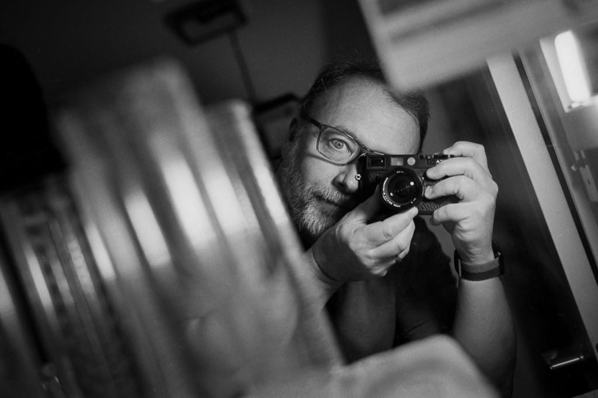
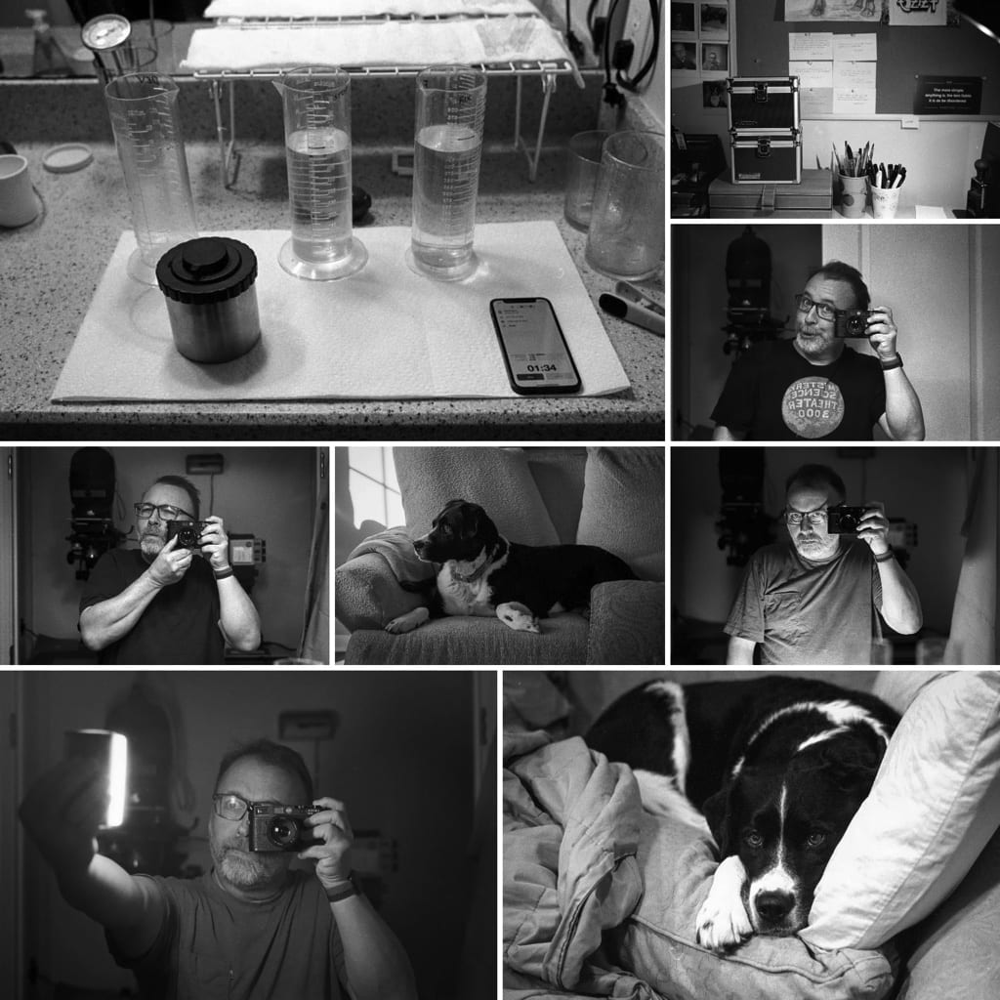

# Are there really only three things to photograph?

There are always cameras loaded with film scattered around my house. I don’t go out much, so sometimes I’ll pick up a camera and take a random photo just for the _feel_ of it and to use up some film. These photos are almost always one of three things: Myself, my dog, or my desk/workspace.

Case in point, I recently finished the roll that’s been languishing in the M6 by taking the following mirror self-portrait.

I actually like the photo. It’s playful and well-executed overall. But the rest of the roll? It’s chock full of shitty mirror self-portraits and random dog and workspace photos. I really do need to get out more.

