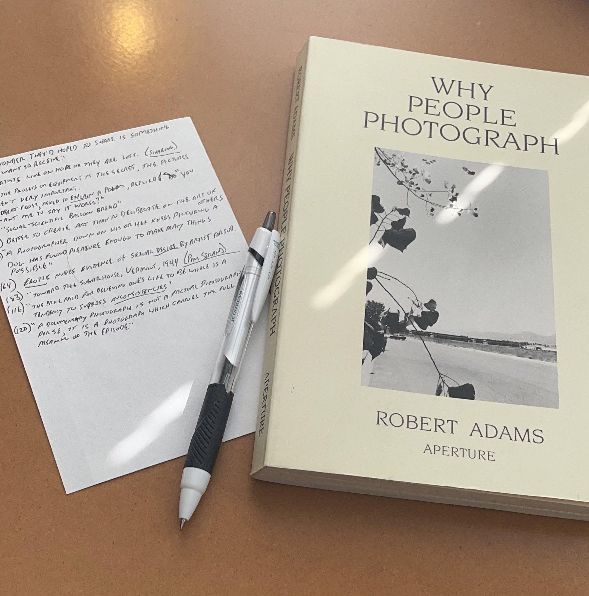

# Taking notes while reading

In a recent post, My Antinet and Barthes’ “Camera Lucida”, I wrote about having shelves filled with books that I remember nothing about. Seems like a waste, no?

Writing notes (by hand) while reading new books has completely changed the way I read and I am finding many benefits: More deliberate consumption, better recall, and a physical residue of the things I’ve read.

As I read, I find myself looking for things to “keep”. I write brief keywords, quotes, and short phrases as references on 4×6 index cards. After completing a book, I re-read the notes and, if something triggers further interest, I re-visit the referenced pages and make longer notes on separate cards. Lots of people do something similar, but this is what I do and it’s been a great help.

(I know this is all very “Zettelkasten-ey”, but I’m trying to avoid using trendy, sound-smart words for what’s basically just a box of notes.)

