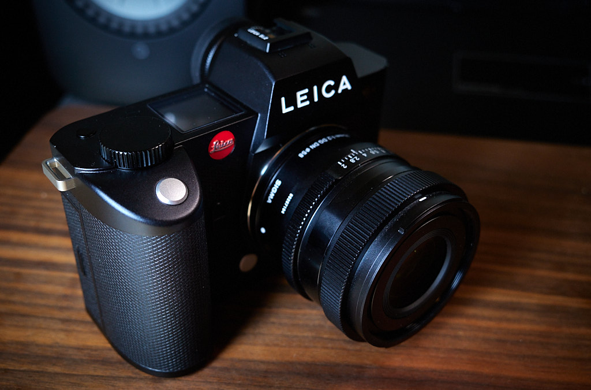
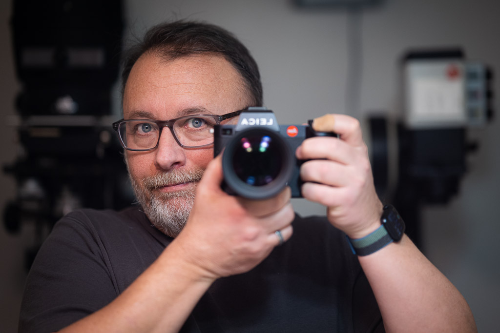

# Leica SL2

The [Leica SL2](https://leica-camera.com/en-US/photography/cameras/sl/sl2-black/details) felt inevitable. After an almost accidental run with the Panasonic S5, which I didn’t enjoy at all, I tried going back to the Fuji system. I’ve always liked Fujifilm cameras and their classic control layout. I purchased a new X-T5 and a few nice lenses late last year, but it didn’t grow on me. The X-T5 is a great camera and I had nothing to complain about. Except it just didn’t give me The Feels. Not the way, say, a Leica does.

I decided that I wasn’t going to be satisfied until I was back with Leica for my digital camera. My heart wanted me to buy another M10-R but we all know how that turns out.

A project I’ve had on the back burner for a couple of years is shooting formal portraits of my extended family. I’d like to get started on that, so I thought I’d move toward a more flexible mirrorless system and decided this was a good time to move to an SL2.

I’ve owned the lower-resolution SL2-S before, and it was fantastic. At the time, I was more interested in digital black and white, so I traded the SL2-S for a Q2 Monochrom. That was fun for a while, but this time I need to be more practical, so I opted for the 47 Megapixel SL2.

The moment I picked up the SL2 I knew I’d done the right thing, and promptly forgot about the price. The SL2 is dense, heavy, solid, and feels perfect in hand. And most importantly, it gives me The Feels.

I no longer have any native Leica L-mount lenses, but I do have a couple of very good Sigma lenses: The 35mm f2.0 DG DN “Contemporary” and the amazing 85mm f1.4 “Art” lens. I also intend to spend a lot of time with my Leica M lenses mounted via the Leica M-Adapter L. The SL2’s viewfinder is second to none and, with focus peaking, makes using manual focus lenses as easy as it gets.

Now it’s up to me to go _do_ something with it.

