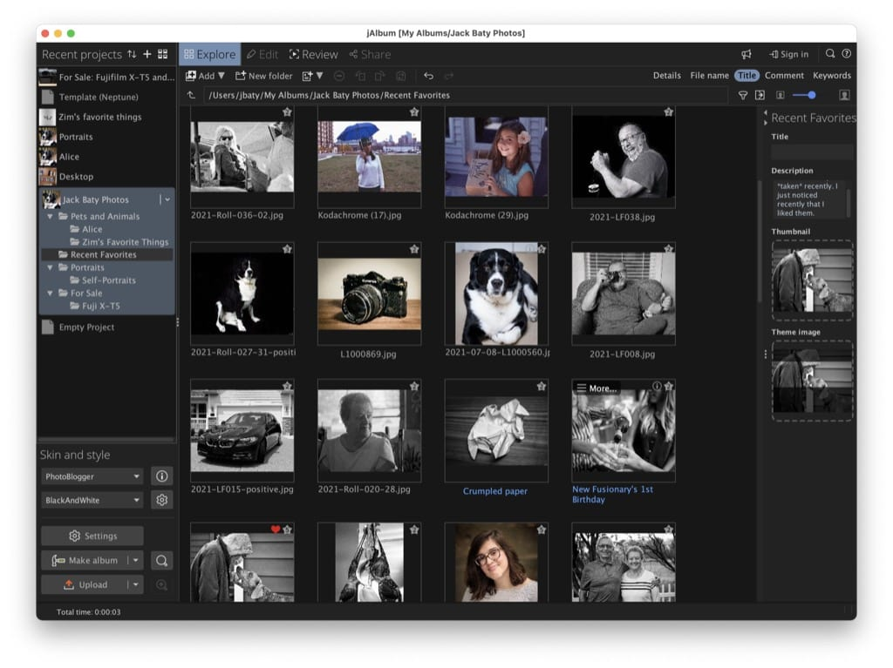

# Using jAlbum for photo galleries

I’ve been a [Flickr user](https://flickr.com/photos/jbaty) since 2004 and a SmugMug user for nearly as long. For some reason, I prefer looking at my photos via online galleries rather than, say, my Photos library, and both Flickr and SmugMug have helped me do that.

I’ve also kept standalone static web galleries for the odd side project, such as a [memorial to my dog Leeloo](https://static.baty.net/galleries/pets/leeloo2016/). Recently, I’ve been creating more of these, so I started looking for easier or better ways of generating static web galleries from a selection of photos. There are what feels like a thousand options. Everything from giant GUI apps to the nerdiest little command line utilities.

After looking around a bit, I’ve settled on [jAlbum](https://jalbum.net/en/). I didn’t expect to like it. After all, it’s from that time (2004) when software was named so that everyone knew what it was written in. And I developed an allergy to Java not long after that. Go figure!

jAlbum is surprisingly robust and capable, while still being simple to use. The defaults are mostly fine, but it lets me tweak the dickens out of it, should I want to.

I’ve only spent the morning with it, but I have created some initial galleries at [static.baty.net/photos](https://static.baty.net/photos/). I think it already looks fine, and I haven’t even begun to tweak it.

jAlbum has built-in (S)FTP capability for automating the process of getting everything out to my server, but it doesn’t support ssh keys so I can’t use that. I’m instead using rsync via a tiny Makefile, so all I need to do is type `make` and the changes are deployed.

