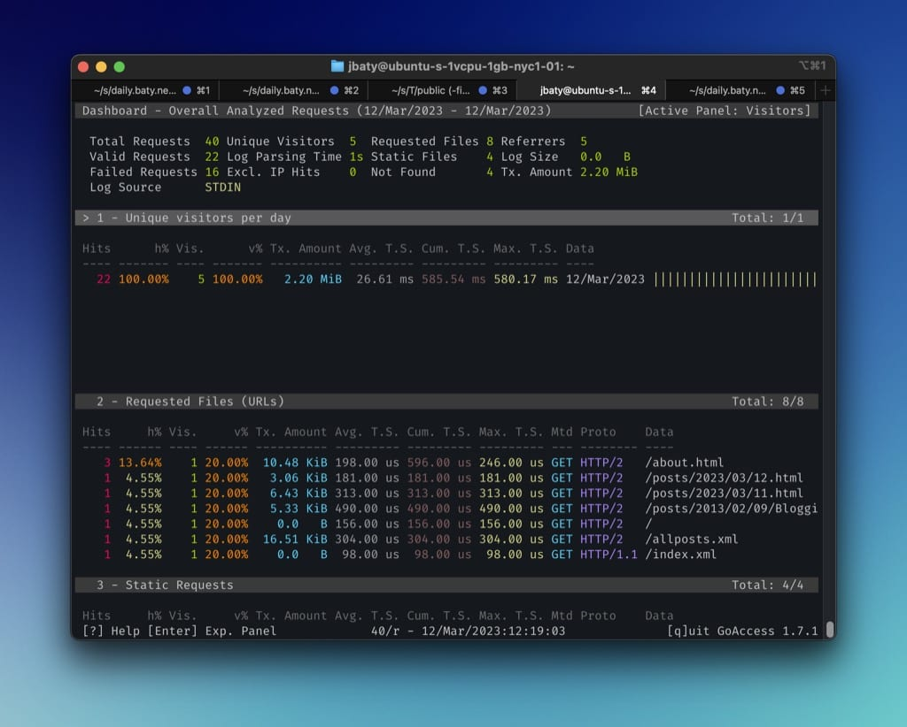

# Viewing Caddy logs by date in GoAccess

UPDATE: I’ve had trouble getting GoAccess to parse the logs consistently after changing the date format.

I’ve been using [GoAccess](https://goaccess.io/) on the VPS running my static sites for keeping an eye on web server access logs. It works great and requires no tracking scripts. I run a cron job every five minutes to process my site logs and generate an HTML report. This is fine, but GoAccess always processes the entire log file and offers no way to filter the results. Sometimes I only want to see stats for, say, today or for the past week.

To do this, I run GoAccess on only a subset of the log file using the command line directly on the server. The [GoAccess man page](https://goaccess.io/man) includes some examples using `sed` so that’s where I started. The first problem I ran into was that Caddy’s log files use json by default rather than the trusty old common or combined formats. The default log format uses a UNIX timestamp for dates, so the first thing to do was to change the format to iso8601 in Caddy’s configuration, like so…


```
daily.baty.net {
    log {
        output file /home/jbaty/logs/caddy/daily.baty.net.log
        format json {
            time_format iso8601
        }
    }
}
```

Now I can parse the logs based on the date using sed:

```sh
#!/bin/sh

sed -n '/'$(date '+%Y\/%m\/%d' -d 'today')'/,$ p' logs/caddy/daily.baty.net.log | goaccess -a --unknowns-as-crawlers --ignore-crawlers -
```

Now when I run `./stats-today` on the server, I get something like this:



Check me out with my 5 whole visitors so far this morning! 😆
