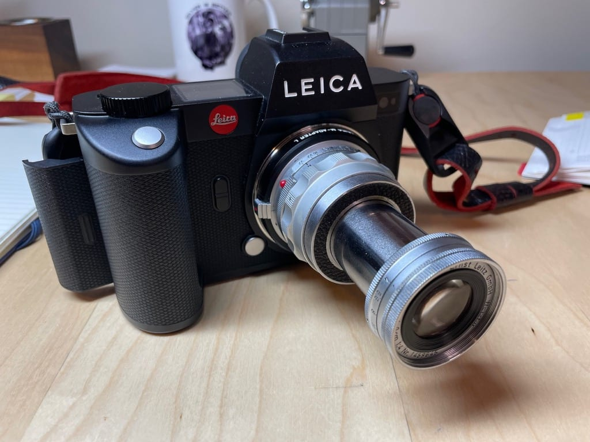
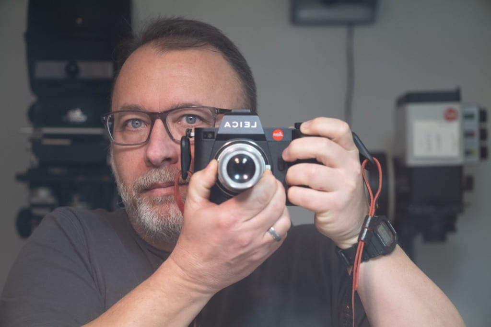

# Leitz Elmar 9cm f4.0

This Leitz Elmar 9cm f4.0 is by far the worst lens I own.

And yet, I’m drawn to it for that very reason. I’m feeling a pull toward low-fi digital. Or at least imperfect digital. I’m not tempted to go buy a 2003 digicam like the kids are doing, but I’m also not drawn toward the APO-Summicron-SL that I used to shoot with.

This Elmar is quite soft and has such low contrast that it seems like there’s something wrong with it. As an example, here’s a mirror self-portrait straight out of camera:

Awful, right? Gloriously, satisfyingly awful!

This lens has been sitting on a shelf for years because I didn’t see the point, when so many better lenses are readily available. But now I’m thinking that maybe I’ll find a few “shitty” lenses to shoot with and see how it goes.
