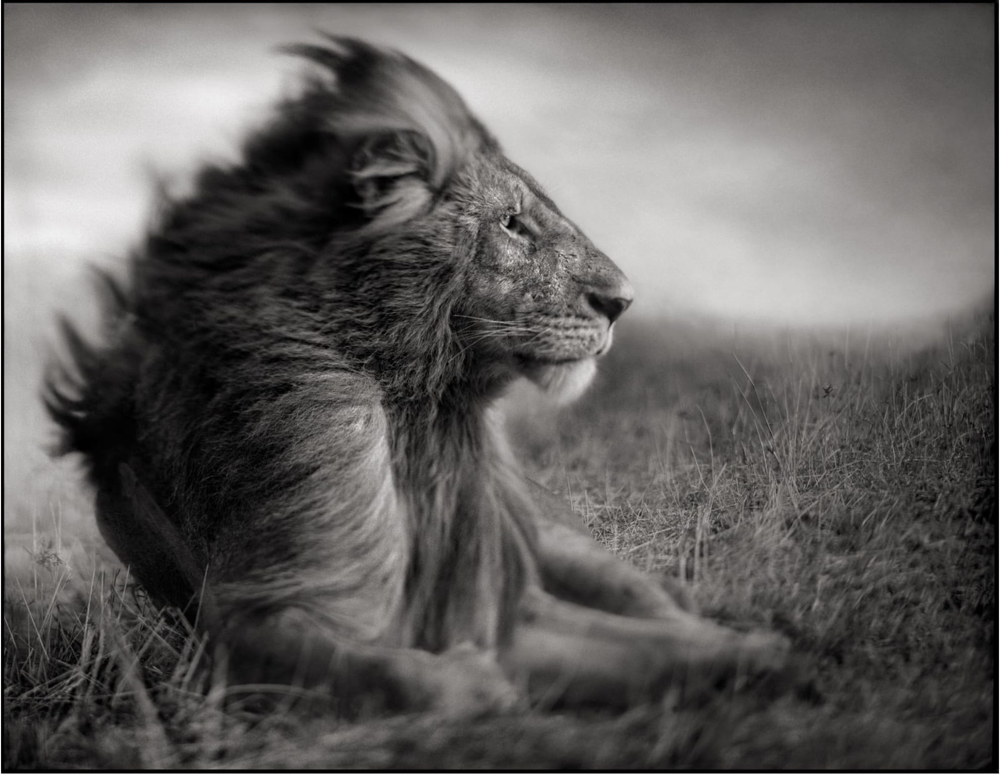

# Nick Brandt on using a digital camera – I hated it

> I brought a Hasselblad 60 megapixel medium format digital camera to Africa with me. I took photos side by side with my film camera. The digital camera’s images were sharper. They had more detail in both the shadows and the highlights. The digital camera made photographing very, very easy.
> 
> And I hated it. … In fact, had I photographed using a digital camera from the beginning, I’m not sure that I would have liked a single photograph that I had ever taken.
> 
> Nick Brandt, [I am the Walrus](https://www.nickbrandt.com/essays/essays:-across-the-ravaged-land/i-am-the-walrus/)

His animal photographs are astonishing. And he uses short (50-100mm equiv. on 35mm film) lenses on film cameras. Amazing.
  

