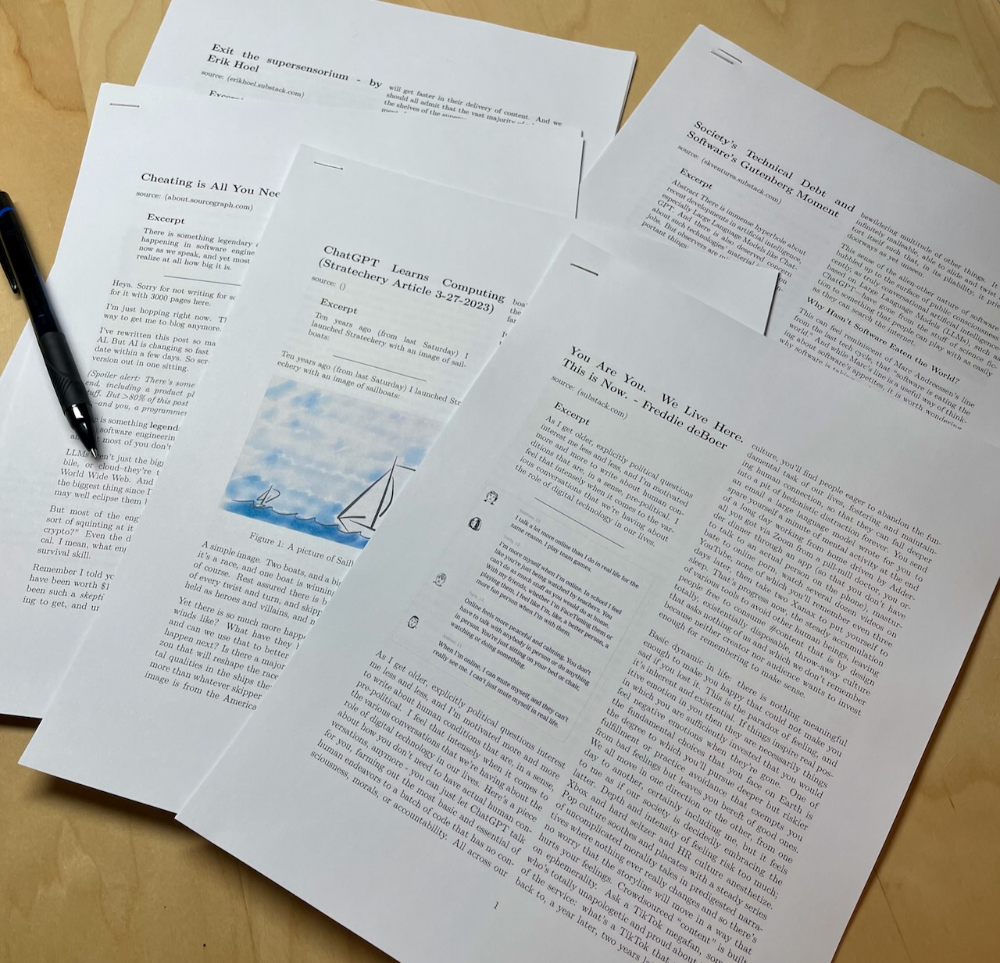

# My read-later service is made of paper

I’ve tried so many “read-later” services that I can’t remember half of them. They’re all basically the same: visit a website, click a button, and the article is saved to a list somewhere with all the other articles I’ve saved. Some newer services get fancy with recommendations, UI improvements, social integration, etc. but they all just gather a list of articles that I almost never end up reading. But, you know, just in case, right?

I started [printing long-form articles](https://baty.net/baty.net/2020/reading-long-form-web-articles-by-printing-them-first) that I wanted to read in 2020 and that continues today. It’s the first read-later service that has stuck with me. My [process for printing articles](https://baty.net/2022/printing-web-pages) works great. I love the concise, two-column format I get from my Pandoc template. The Pandoc-\>LaTeX-\>PDF typesetting is so good and makes long-form text super easy to read. That, along with double-sided printing keeps the page count nice and low (it’s less annoying for the forests).

The printed articles are stapled and stacked on my reading desk. When I feel like digging through them, I sit down, grab a pen and highlighter, and slowly and calmly read stuff. It’s low-tech, offline, and comes with zero distractions. The minor friction around collecting articles keeps me from dumping everything into the pile. I only keep what I _actually want to read_, instead of everything I might maybe (but probably not) get to someday.

It’s a good system.