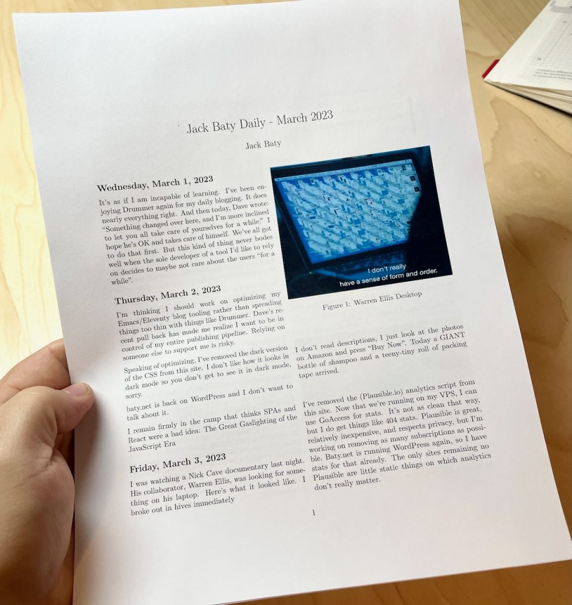

# Printing daily.baty.net

At the end of each month, I convert my [Org-journal](https://github.com/bastibe/org-journal) entries into a nice PDF, print it, and put it into a binder.

It occurred to me that my [daily.baty.net](https://daily.baty.net/) website content is just a bunch of markdown files that could be treated the same as my org-journal files and perhaps printed as well.

I started by concatenating March’s entries into a single Markdown file, like so:

    cat 2023-03*.md >> ~/Desktop/202303-MarchBlog.md

The resulting file wasn’t in great shape for printing, so I had to clean it up. At minimum, I needed to do the following:

*   Convert the YAML titles into Markdown headings (e.g. “title: Saturday, March 4, 2023”)
*   Remove all YAML delimiters (“—“)
*   Remove all date lines (e.g. “date: 2023-03-31T05:59:55.10-4:00”)
*   Convert absolute image links to relative links

My first approach was to create a [Text Factory in BBEdit](https://www.barebones.com/products/bbedit/benefitsexercise.html). Text Factories are re-usable bundles of BBEdit’s text transformation commands constructed using a handy UI. Here’s what it looks like:


This worked fine, and I assumed I was finished, but I wondered if there might be an easy way to do the same thing in Emacs. I’m terrible at writing lisp, so I cheated and asked ChatGPT to write it for me. To create the prompt, I copied the descriptions out of the screenshot shown above and pasted them into my prompt. It was just a list of things like “Search and replace “](/img/202” with “](./img/202”

ChatGPT wrote the function, added comments, and summarized what it did. The code was wrong about a couple of things, but it got me maybe 75% of what I needed in a couple of minutes. Say what you will about AI, but it’s darn helpful, even though it’s flawed. After some tweaking, I ended up with the following emacs function:

```lisp
(defun jab/process-daily-blog-export ()
  "Converts Markdown file of concatenated daily.baty.net entries"
  (interactive)
  (save-excursion
    ;; Replace title: lines with ## heading
    (goto-char (point-min))
    (while (re-search-forward "^title: \"\\(.*\\)\"$"  nil t)
      (replace-match "## \\1"))

    ;; Remove YAML delimiters "---"
    (goto-char (point-min))
    (while (re-search-forward "---$" nil t)
      (replace-match "\n"))

    ;; Make image paths relative
    (goto-char (point-min))
    (while (re-search-forward "](\/img\/202" nil t)
      (replace-match "](./img/202"))

    ;; Remove lines matching "^date: "
    (goto-char (point-min))
    (while (re-search-forward "^date: .*" nil t)
      (delete-region (line-beginning-position) (line-end-position)))))
```

Like I said, I’m terrible at writing Lisp, and there may be a dozen better ways of approaching this, but this worked fine and was easy to do (with AI’s help).

All that remained was to add my usual Pandoc headers and print using the same template I use for [Printing web pages](https://baty.net/2022/printing-web-pages) and the result is a nice, printed copy of my blog for the month. At some point I may try and automate the rest of the process, but this is good enough for now.


