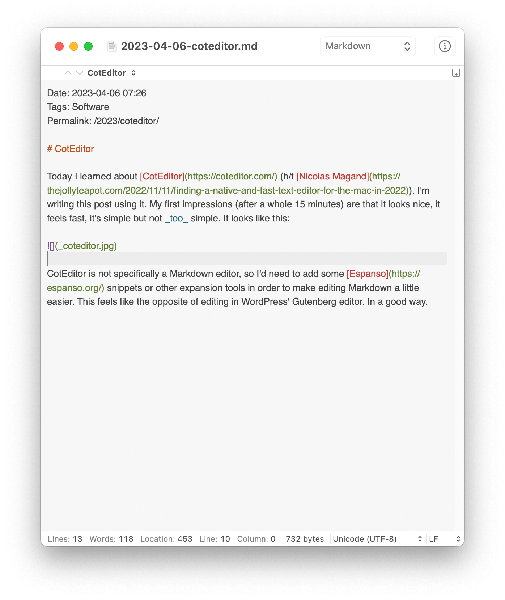

Date: 2023-04-06 07:26
Tags: Software
Permalink: /2023/coteditor/

# CotEditor

Today I learned about [CotEditor](https://coteditor.com/) (h/t [Nicolas Magand](https://thejollyteapot.com/2022/11/11/finding-a-native-and-fast-text-editor-for-the-mac-in-2022)). I'm writing this post using it. My first impressions (after a whole 15 minutes) are that it looks nice, it feels fast, it's simple but not _too_ simple. It looks like this:

CotEditor is not specifically a Markdown editor, so I'd need to add some [Espanso](https://espanso.org/) snippets or other expansion tools in order to make editing Markdown a little easier. This feels like the opposite of editing in WordPress' Gutenberg editor. In a good way.

