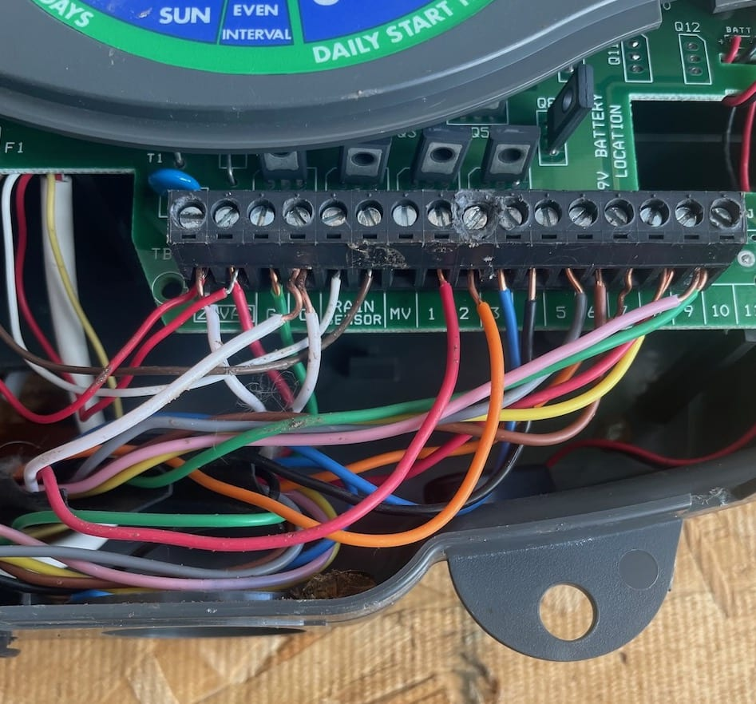
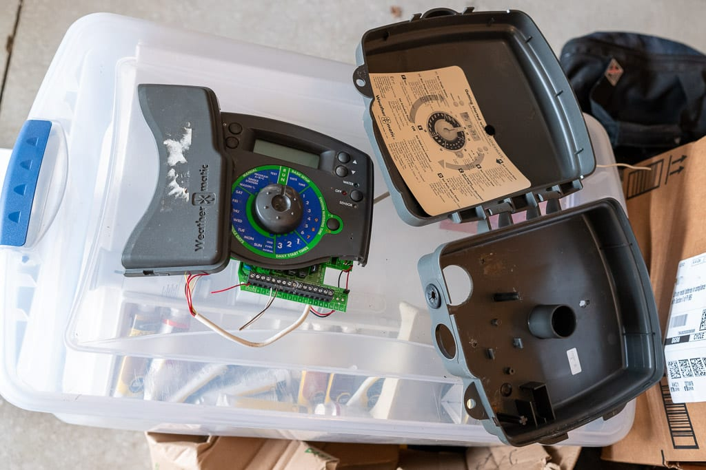
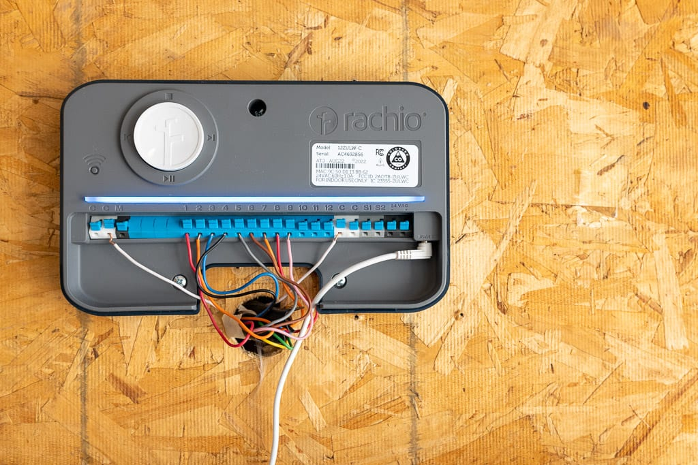
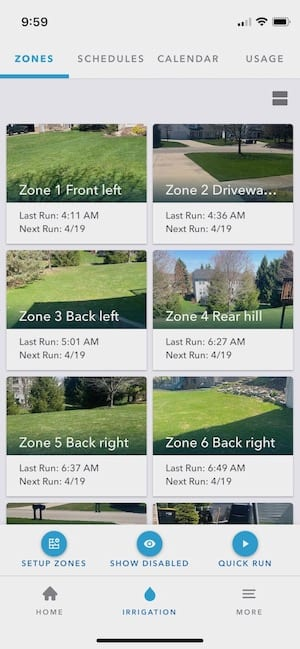
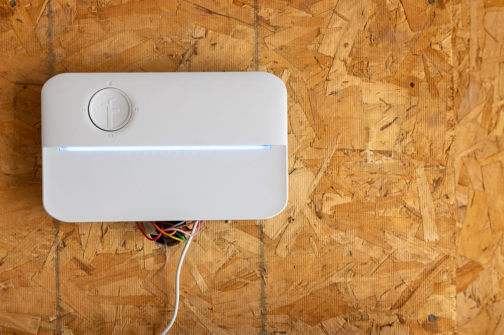

# Installing a new sprinkler system controller

I replaced our flaky sprinkler system controller this weekend. All by myself.

<iframe
style="position:absolute; width:100%; height:100%;"
src="https://getyarn.io/yarn-clip/c56575f3-3077-4548-ba8d-6e70453ecf75/embed?autoplay=false&responsive=true"
frameborder="0"
></iframe>

The unit I chose was the [Rachio 3 Smart Sprinkler Controller](https://rachio.com/products/rachio-3/). They offer 4, 8, and 16-zone versions. My system has 9 zones because of course it does. The good news was that Costco sells a version with 12 zones for the same price as the standard 8-zone model. Yay me!

I'm not a handy person, so it was with some trepidation that I even started this project. I was careful to remember to take lots of "before" photos to use as a reference.

Removing the old housing was a little tricky because it was nailed to the backing board rather than screwed. 

Three screws later and the new controller was in place. I used the reference photos to connect the wiring and it was time to test everything.

The Rachio app walked me through getting everything set up. Of course nothing worked. I had missed one common wire. Once that was in place, the system was working. The next step was to go through each zone and indicate grass type, soil type, amount of sun, grade, etc. This took me about thirty minutes, after which a default schedule was created for me, using the information for each zone.

It's pretty cool. The app knows my local weather conditions, and skips runs based on wind, temperature, and rainfall. My wife has access so she can start and stop things any time, right from her phone. I was excited to add it to HomeKit until I read that they'd recently [abandoned HomeKit support](https://9to5mac.com/2022/10/03/rachio-smart-sprinkler-homekit-no-response/). Well, crap. That would have been nice.

The first run ran as scheduled this morning. I received a text letting me know it was about to start. The run is timed to start so that it "ends before sunrise". The next run has been automatically postponed until next Wednesday, as it's supposed to rain tomorrow and Monday. Pretty cool.

Once in a while, I get a DiY project right. Feels good when that happens.

