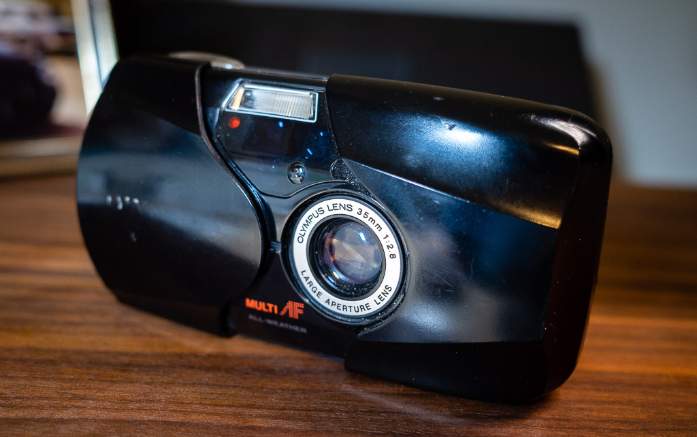
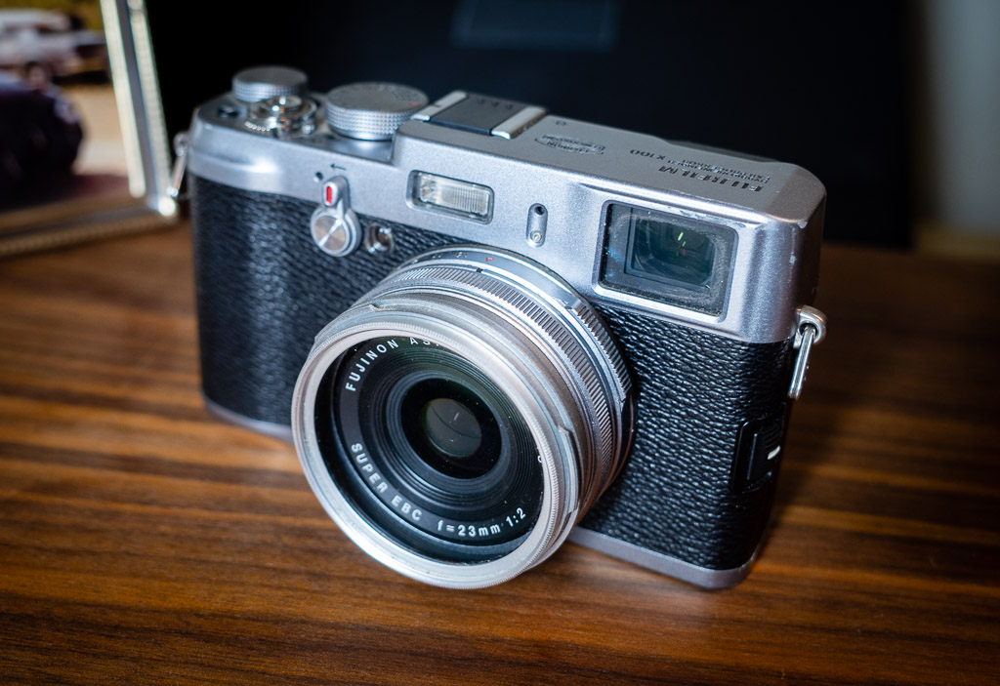

# Some old cameras I found in storage

While doing some spring cleaning this week, I ran into a box of old cameras that I had marked "To Sell" but forgot about. The box had an old Olympus digital and a bunch of beat-up OM-2n film cameras and accessories. This was neat, but what I was most exited about were two cameras in particular: An original Fujifilm X100 and an Olympus Stylus Epic.

Here's the Epic:

I bought this little camera for $75 [in 2004](https://archive.baty.net/2004/olympus-stylus-epic/). I [bought another in 2012](https://archive.baty.net/2012/201211replacing-my-olympus-stylus-epic/) because there were problems with the original. Still, I put a roll in it and so far, so good. I just love them. I hope the two that I have last for a while, because I refuse to pay the $200-$300 they fetch these days.

The second camera is even cooler: an original Fujifilm X100 from 2010. This was such a nice discovery because I couldn't remember selling it, but also couldn't seem to find it. 

The Internet says that the CMOS sensor on the OG X100 has some kind of magical qualities, but I've never really seen it. It's a wonderful little camera that still takes nice enough 12MP photos. It's pretty slow to focus compared to current models, but it's fine in most conditions.

I charged the battery but the camera wouldn't power on. I paid $12 for a replacement battery and the camera seems to work fine now. Can you tell I'm excited?

