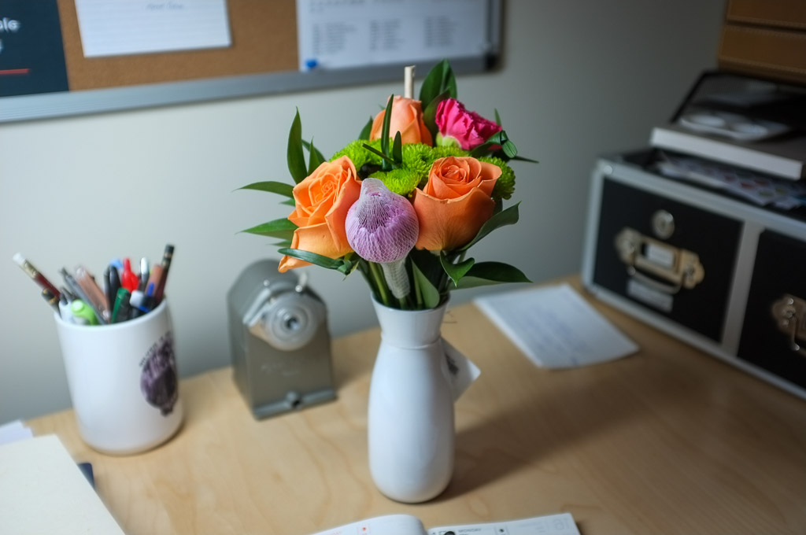
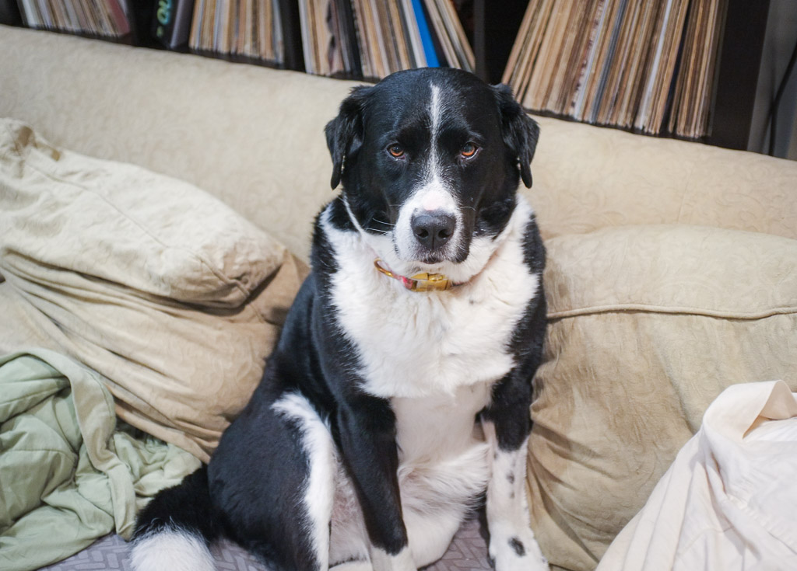

# A week with the (original) Fuji X100

I recently [found my original Fujifilm X100](/2023/some-old-cameras) in a box in our storage unit. I have such fond memories of the camera, so I knew I would enjoy using it, even today.

I was surprised to learn that I _didn't_ enjoy it as much as I thought I would. It still feels great to carry, but it's not quite as nice to actually use as I expected.

It's kind of slow. Slow to power on. Slow to focus. Slow to navigate. This shouldn't bother me, as I often use old, manual-focus cameras and I'm used to working slowly. I guess the difference is that if I'm going ask the camera to do things, it should be faster than I am. The X100 isn't. It's not unusable, but it takes a bit of the joy out of using the camera.

I can live with slowness, but what I'm finding the most troublesome is the tiny, awkward controls on the rear of the camera. Specifically, the Menu/OK button. I cannot seem to press that button without accidentally pressing one of the surrounding buttons first. It's maddening.

What about image quality? It's fine, I guess. Honestly, I prefer the look of the files from my little Ricoh GRIII. Coming from the 50MP of my SL2 makes the 12MP X100 files feel a little limited. I'll keep tinkering in Lightroom to find the right mix of adjustments, which will probably help.

I do like the black and white conversions I'm getting, though. I don't know what it is, exactly, but they have a certain grit to them that I like. 

Will I use the X100 every day? Probably not. It's a fun, cute, small, rangefinder-style camera with an optical viewfinder, so I'm sure I'll bring it out occasionally.

I'm mostly stuck at home this week while our kitchen is being remodeled, but I did take a few snaps with the Fuji. Here are some samples.

